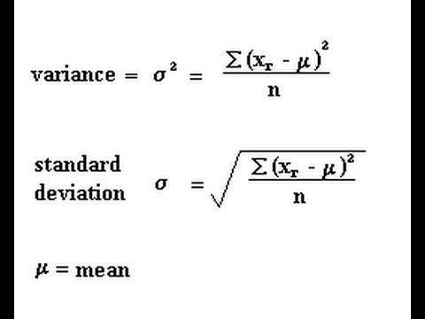

# Data Analysis

## Amazon Athena

 provides a **simplified**, flexible way to analyze petabytes of data where it lives. Is an **interactive query service** that makes it easy to analyze the data stored in Amazon S3 using standard SQL. Athena is **serverless**, so there is no infrastructure to manage, and you pay only for the queries that you run. Supports query federation and UDFs.

Supports many data formats: csv,l json, orc, parquet, avro , unstructured, semi-structured or structured

**presto** under the hood 

examples: queries to logs, analyze CloudTrail

S3 → Glue to transform to columns → Analyze data with Athena 

Save many → column format - orc, parquet  

TLS between s3 and athena 

Athena performs much more efficiently and at lower cost when using **columnar formats** such as **Parquet or ORC.** 

NOT for visualizatsion (QuickSight), not for ETL (Glue)

## Amazon QuickSight**

build **visualizations**, perform ad-hoc analysis, and quickly get business insights from their data, anytime, on any device. 

**serverless** 

interactive visualizations of the data 

dashboards KPIs

connect to different data sources: RDS, redshift, athena, EC2 

**SPICE** - super fast parallel in memory calculations 

10 gb space 

**ML algorithms** 

- Anomaly detection Random CUT Forest
- Forecasting
- Autonarratives translating seasonality and trends into words

Security: VPC, IAM 

Autograph , scatterplot, heatmap, correlations, histograms, line charts over time, pie charts, tree maps 

## Amazon Simple Workflow Service

(Amazon SWF) makes it easy to build applications that coordinate work across distributed components

## Identify and implement a Data Transformation solution

### Data types

**numerical** 

- discrete data
- Continuous data

**categorical**  

- ordinal: numerical measurement with order (size L>M>S)
- nominal: no order (colors)
- binary: 0 o 1

### Transformations

- Polynomial transformation x→ x^2 if degree is too high → risk of overfitting
- Radial basis function → transform to a center - is a real-valued function whose value depends only on the distance between the input and some fixed point.
- you can create a new feature

# Feature engineering

which features should I use? How to handle missing information, etc 

curse of dimensionality - too many features can be problematic 

- the more features the more sparse data becomes
- performance - too much computations

## Imputation of Missing values

- removing when you have a lot of data
- fill column with the value of another column
- fill with median, mean, mode, most frequent, etc
- Fill with median better than mean when outliers are present
- Deep learning is better suited to the imputation of categorical data
- use KNN for imputation of numerical data
- Regression for finding linear or non linear relationship - MICE (Multiple Imputations Ch)
- Last Observation Carried Forward (LOCF): used in a time-based dataset. A
missing value is replaced with the latest or last observed value in the dataset
- Next Observation Carried Backward (NOCB): reverse order to LOCF
- Multiple Imputation by Chained Equations or MICE method. This method is executed through multiple regression models followed by modeling each missing value conditionally based on the observed values of the dataset
- **Labeled data**
    - manual
    - Mechanical Turk

## Scaling

If the range is different apply / decision tree, random forest, xgboost are **not sensitive to scale** 

maxabs scaler

robust scaler

min max scaler

## Normalization

change the range between 0 and 1

Normalization does NOT handle outliers well

**Central Limit Theory:** no matter original distribution, the mean will follow a normal distribution 

## Binning

is a data pre-processing method used to minimize the effects of small observation errors.

Quantile bining - to assign the same number of observations to each bin

## Outliers

find variance for each point (distance to the mean) and then the overall 

then standard deviation 

how many standard deviation is far from the mean 

look at the distribution 

Use random cut

## Filter selection

to be more specific, for example remove color or noise from an image 

## One hot encoding

## Dimension Reduction

### PCA - Principal Component Analysis

Find patterns based on correlations between features 

explain variance in % 

covariance matrix is created and then singular value decomposition SVD 

### Kernel PCA

non-linear transformation - distance from the center to see how the groups are separated 

### LDA

separate 2 classes , supervised assume data is normalized 

reduce to #classes - 1 component

## Feature selection vs feature extraction

selection / find more features 

extraction / combine original features to generate new ones

# Analyze and visualize data for machine learning

## historgram

bar graph-like representation of data that buckets a range of classes into columns along the horizontal x-axis.The vertical y-axis represents the number count or percentage of occurrences in the data for each column.It is used to summarize discrete or continuous data that are measured on an interval scale. 
.

## boxplot

A boxplot is a standardized way of displaying the distribution of data based on a five number summary (“minimum”, first quartile [Q1], median, third quartile [Q3] and “maximum”).

## correlation heatmap

## Pairs plot

show the relationship between pairs of features as well as the distribution of one
of the variables in relation to the other

## scatter plot

[Continue to ML on AWS Section](ML_on_AWS.md)