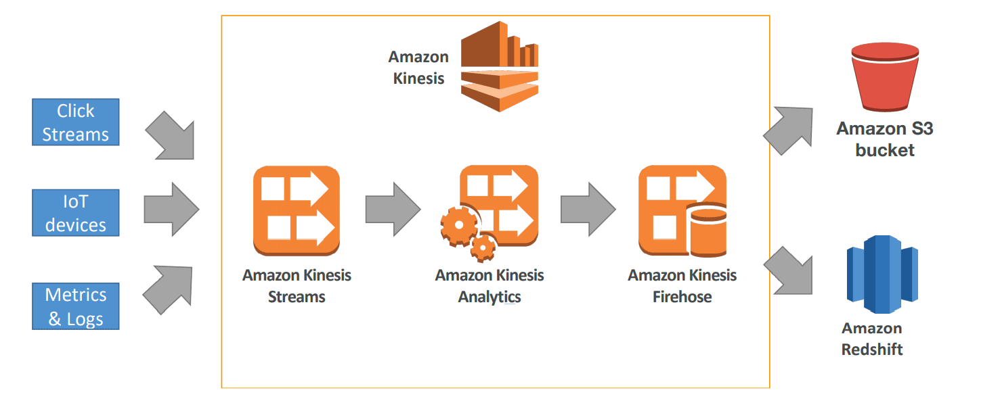

# Data Engineering

# Storage

## **Amazon EBS**

Amazon Elastic Block Store  block level storage volumes for EC2 instances.

**Amazon Elastic File System (Amazon EFS)** 

automatically grows and shrinks as you add and remove files.

## **Amazon FSx**

makes it easy and cost-effective to launch, run, and scale feature-rich, high-performance **file systems** in the cloud.

## **Amazon Redshift**

Fully managed, **petabyte-scale data warehouse** service in the cloud. You can start with just a few hundred gigabytes of data and **scale to a petabyte** or more. This allows you to use your data to gain new insights for your business and customers.

- Data job styles/types (batch load, streaming)
- Data ingestion pipelines (Batch-based ML workloads and streaming-based ML workloads)
- Data warehouse, sql analytics, **OLAP** -online analytical processing
- Load data from S3 to Redshift / Redshift Spectrum (access S3 without loading the data)

## **Amazon S3**

Amazon Simple Storage Service is an object storage service that offers industry-leading scalability, data availability, security, and performance.

- For store object or files in buckets
- Files can be from 0 bytes to 5Tb - if you have large datasets, need to divide into several chunks
- Unlimited storage
- Universal namespace (names must be unique globally)
- centralized architecture
- supports any kind of file format

**Data partitioning:** 

- example by date /year/month/day/hour/data.csv
- example by product /product_id/data.csv

**Storage classes**

s3 class can be edited in Lifecycle configuration, and you can automate editing Lifecycle Rules (transitions, expirations actions by tags, date, etc)

durability (how much time in long data will be available) and availability (time to wait to access data)

- Standard general propose: frequent access to data , low latency , high throughput
- standard infrequent access IA: less frequent access, cost on retrieval , high availability (backup)
- One zone infrequent access: high durability (secondary backup , when data is accessed is destroyed)
- Glacier instant retrieval: low cost object storage , milliseconds retrieval , min storage duration 90 days
- Glacier  flexible retrieval: 1-5 min , 3-5 hours, bulk 5-12 hours , 90 days
- Glacier deep archive: for long term storage , 180 days
- Glacier intelligent tier: no retrieval charges , move objects between access patterns

**Amazon S3 Analytics** - recommendations for Standar and Standar IA s3 bucket / 24 to 48 hours to see analytics 

**Encryption**

- SSE-S3: encrypts object with keys handle by AWS: unique key for each object , user does not have control.
- SSE-KMS: use AWS Key Management Service, more secure
- SSE-C: you want to manage your own encryption keys
- Client Side Encryption: outside AWS

**Security**

- User based
- Resource based : bucket policies, object access control , bucket access control

JSON bucket policies: use for grant public access to a bucket, force object to encrypt, grant access to another account 

- resources: bucket and objects
- actions: set of API to allow or deny
- effect: allow/deny
- principal : account or user to apply the policy

Default encryption vs bucket policies → you can set a default encryption for all new object in the bucket 

Use tags to restrict access to certain files in S3 

**Networking** 

VPC Endpoint Gateway → allow traffic go stay within your VPC (instead of going through public web )

## **Apache Avro ****

Is the leading **serialization** format for record data,  **streaming** data pipelines

## **Amazon DynamoDB**

is a fully managed, **serverless**, key-value **NoSQL** database designed to run high-performance applications at any scale. 

useful to store a ML model to be served by an application  

## **RDS/Aurora**

Relational DB (MySQL, SQL Server, Oracle, Postgres, Aurora, MariaDB)

SQL 

**OLTP** - Online Transaction Processing 

must provision servers in advance 

## ElasticSearch / OpenSearch

- Indexing data
- search amongst data points
- clickstream analytics

## ElasticCahe

caching mechanism 

# Formats

- row oriented (csv) / Avro / RDS
- column oriented / Parquet / ORC
- user-defined format (JSON) / HDFS

**Predictive Model Markup Language (PMML)**   XML-based standard  statistical and data-mining models 

# Data Ingestion

## **Data types**

- sequential, tabular, matrix
- text, images, tabular, videos, audio, files
- structured, unstructured
- time series

## **Tools**

### **AWS Glue**

**Serverless** **data integration service** that makes it easier to discover, prepare, move, and integrate data from multiple sources for analytics, machine learning (ML), and application development.

- Crawlers help infer the schema and build the catalog.
- Need IAM role
- Can create Zeppelin notebooks to do ad-hoc transformations
- AWS Glue can also connect to a variety of on-premises JDBC data stores such as PostgreSQL, MySQL, Oracle, Microsoft SQL Server, and MariaDB.
- integratet with athena or redshift
- underlying platform for Glue ETL - serverless Apache Spark platform

**Glue ETL** 

- Code is Python or Scala
- **better to transform csv to Parquet saving data in S3**
- jobs can run on spark platform
- bundled transformations - drop fields, dilkter, join, map
- findmatches ML transformation - identify duplicated records
- Format transformations Apache ORC, Parquet, JSON, CSV,...
- Spark transformations

### AWS Batch

- **schedule** jobs
- run batch jobs in docker images (must provide Docker image)
- dynamic provisioning of EC2 and spot instances
- optimal quantity and type based on volume and requirements
- no need to manage clusters, fully serverless

### **Amazon** **Kinesis**

Alternative to Apache Kafka

### **Amazon Kinesis Data Streams**

 **Serverless** **streaming data service** that makes it easy to capture, process, and store data streams at any scale.

**Objective:** Receive data from different devices 

You can use Kinesis to **ingest** everything from videos, IoT telemetry data, application logs, and just about any other data format live. Leverages shards. Once data is in shard, data multiple consumers can process. 

- **Shard** made of: unique partition key and a sequence id
- is held for **24 hours** by default, up to 7 days (168 hours)
- Can be ingested at **1000 records / sec or up to 1 Mb/s**
- Emits up to **2Mb / sec**
- If you want to Scale you add shards
- Good to have small amount of data coming fast / not for huge amount of information
- **real time applications**
- custom producer and consumer
- replay stream and multiple applications to read from the stream

**Modes**

- Provision mode: pay per shard provisioned
- On-demand mode: when you don’t know capacity in advance, pay per stream per hour. Autoscaling

### **Amazon Kinesis Data Firehose**

 **Extract, transform, and load (ETL)** **service** that reliably captures, transforms, and delivers streaming data to data lakes, data stores, and analytics services. 

- Kinesis Data Streams and Kinesis Data Analytics **cannot write data directly to S3.**
Kinesis Data Firehose is used as the main delivery mechanism for outputting data into
S3. You can also use Lambda to write data into S3.
- Read data from Kinesis Data Stream, CloudWatch or AWS IoT
- Read one by one the records , apply lambda function to transform data, and then write in batches on the destination
- Destinations: Amazon S3, Redshift , ElasticSearch, Splunk , it can be a custom destination
- Send to S3 failed data
- **near real time**
- automatic scaling
- Support conversion from csv/json to parquet / ocr (only for S3)
**better to transform JSON to parquet or orc**

### Amazon Kinesis Analytics

input stream: Kinesis Data Stream or Firehose 

apply query and get output streams 

input 

- Flink → streaming applications
- SQL → SQL applications

use IAM permission 

schema discovery

lambda can ve used for pre-processing 

**Applications**

- streaming ETL
- generate metrics in real time
- responsive analytics
- only pay for resources consumed (not cheap)

Algorithms provided in Kinesis Analytics:

- Random Cut Forest → **anomaly detection** using **recent history**
- Hotspots → locate and return information about relatively dense regions in your data

### Amazon Kinesis Video Stream

Producer camera or DeepLens , one producer per video stream 

consumer : rekognition, sagemaker, ec2 consumer 

keep 1 hour to 10 years 

Use case: consumer Docker in Fargate and save in DynamoDB 

**Kinesis Data Stream → real time streaming for ML applications** 

**Kinesis Data Firehose → ingest massive data near real time and apply etl, save in database** 

**Kinesis Data Analytics → real time query and ETL / ml algorithms on stream** 

**Kinesis Video Stream → real time video stream**

### **Amazon** **Data Pipeline**

**Move data between** different **AWS** compute and storage services, as well as on-premises data sources, at specified intervals. 

- destinations: S3, DynamoDB, Redshift, EMR
- Manage task dependencies
- Highly available
- it launches EC2 instances  -> stores in S3
- Can run on demand or on schedule
- AWS data pipeline can be used to move data from one DynamoDB table in
one region to another region.

Data Pipeline vs Glue → Glue - ETL Data Pipeline move data 

### AWS Step Functions

- design **workflows**
- easy **visualization**
- advance error handling
- audit of the history of workflows
- max execution time of 1 year

can be used to train a ML model - example - start → train  →save  → inference

### **AWS Database Migration Service - DMS**

migrate data from your database that is on-premises, on an Amazon Data base (RDS, Aurora, MongoDB, S3). **DMS does NOT transfer any transformation.** 

CDC continuous Data Replication 

create EC2 instance 

### AWS DataSync

for data **migrations** from on-premises to AWS storage **for file and objects**

DataSync Agent is deployed as a VM and connects to your internal storage 

bring data into aws from outside

[**Continue to Data Visualization and Transformation section**](Data_Analysis.md)