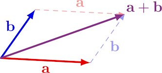
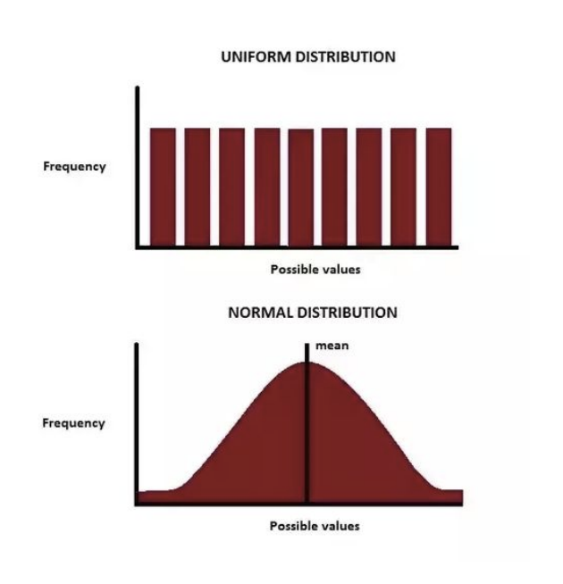
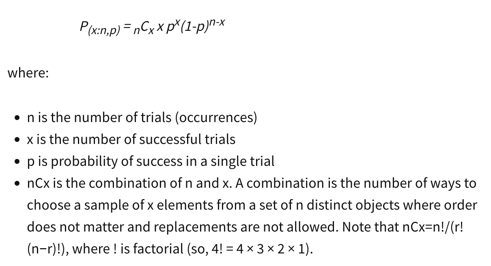
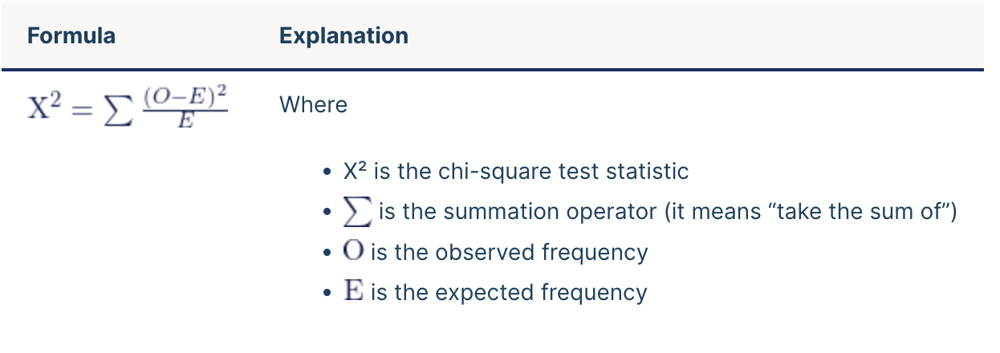
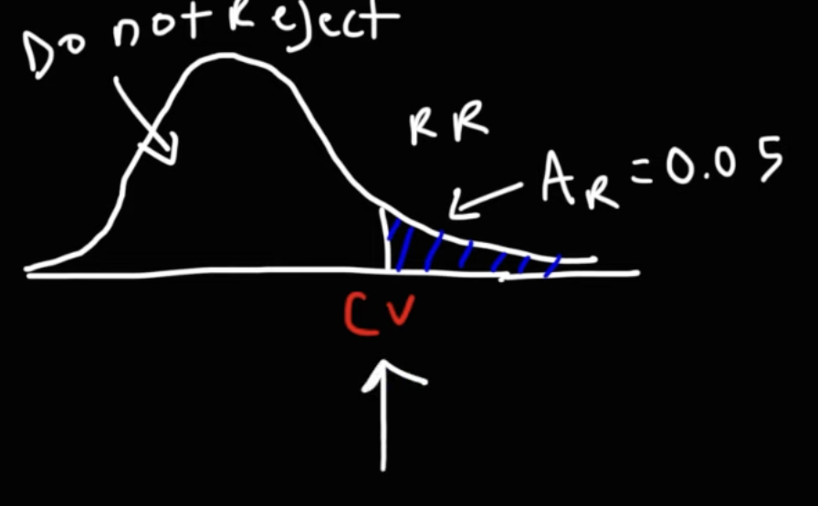
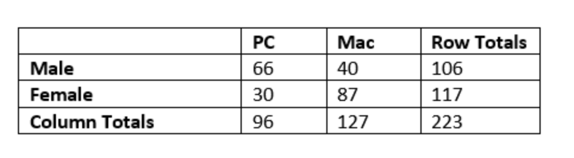
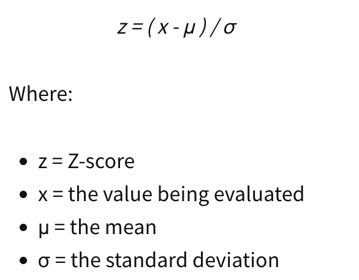
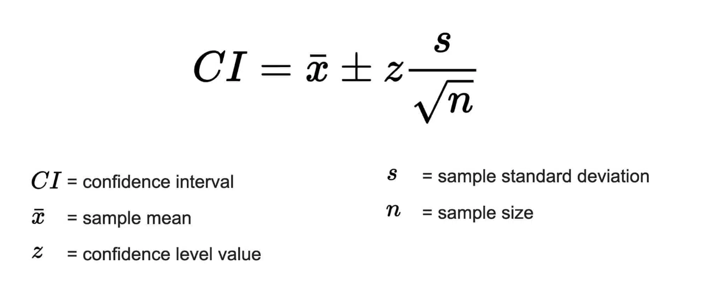

# Math for Machine Learning

# Vectors and matrices

- Vectors : v = [v1,v2,..vn]
- Dimensions n is the dimension of the vector
- Matrix Amxn

# Operations

**Sum**

v = [v1,v2,..,vn] w = [w1,w2,…,wn] 

v+w = [v1+w1,v2+v2,…,vn+wn]

**Scalar multiplication** 

va = a[av1, av2, .., avn]

**Transpose**

vectors → (v + w)^T = v^T + w^T

matrix transpose A^T mxn 

**Multiplication**

vector multiplication

matrix multiplication Anxm Bmxk

**Hadamard Product** 

**Norm**

||v|| ≥0 ||v||=0 only if v=0

All distances are non - negative 

distances multiply with scalar multiplication:

||av|| = |a| ||v||

||v + w|| ≤ ||v|| + ||w||

**Euclidean norm**

**Manhatham norm** 

**LP norm** 

**L1 norm** 

**Linf norm (p tends to inf)**

**L0 norm** used to encapsulate the notion of sparsity ||v||0 = #of non zero elements of vector v 

**Angles**

orthogonal vxw=0 → orthogonal 

**Properties matrices**

**Determinant** 

too much computations when n is large → matrix factorization 

det(A) =0 if columns of A are linear dependent 

**Linear dependence** v1,v2,..,vk are linear dep if lives n <k dimension  a1v1 + a2v2+ … + akvk=0

**Correlation**

**Convariance**

# Probability

**Outcome =** single possibility from the experiment 

**sample space** set of all possible outcomes 

event something you can observe 

**probability** fraction of an experiment where an event occurs 

**bayes**

**independent variables** 

 

**Discrete random variable** countable value X takes finite set of variables 

C**ontinuos random variable** probability of producing any specific outcome = area 

**expected Value** 

**variance**

 ****

**standard deviation**

**Entropy**

one coin Heads 1/2 , tails 1/2 → entropy = 1 bit 

two coins

entropy = 2 bits 

H(X) = expected value [#coins flip] 

**gaussian density function** E = 0, var = 1

# Derivatives

**Multivariate derivative**

**Matrix Hessian**

when gradient = 0 

det(HF) <0 → saddle point

det(HF) >0 

→ tr(HF) >0 → local min 

→ tr(HF) <0 → local max

→ tr(HF) = 0 → does not happen 

det(HF) = 0 → unclear 

**Trace**

# Distributions

## Normal distribution

In general, you'll need to normalize your data if you're going to be using a machine
learning or statistics technique that assumes your data is normally distributed. Some examples of
these include t-tests, ANOVAs, linear regression, linear discriminant analysis (LDA) and Gaussian
naive Bayes. Any method with "Gaussian" in the name probably assumes normality.

## Uniform distribution

A uniform distribution is one in which all values are equally likely within a range (and
impossible beyond that range). 

## Binomial distribution

**Discrete probability distribution** of the number of **successes** in a sequence of n
 independent experiments.

A **single** success/failure experiment is also called a **Bernoulli** trial or Bernoulli experiment, and a sequence of outcomes is called a Bernoulli process.

The underlying assumptions of binomial distribution are that there is only one outcome for each trial, that each trial has the same probability of success, and that each trial is mutually exclusive, or independent of one another.

- The trials are **independent**
- There are only two possible outcomes at each trial,
- The probability of "success" at each trial is constant.

## Negative binomial distribution

Discrete probability distribution that models the number of **failures** in a sequence of independent and identically distributed Bernoulli trials before a specified (non-random) number of successes. 

## Poisson distribution

**Discrete probability** **distribution** that expresses the probability of a given number of events occurring in a **fixed interval** of time or space if these events occur with a known **constant mean rate (lambda)** and independently of the time since the last event.  ****

In binomial distribution Mean > Variance while in poisson distribution mean = variance.

Poisson distributions are often appropriate for **count data.**

For example, a Poisson distribution could be used to explain or predict:

- Text messages per hour
- Machine malfunctions per year
- Website visitors per month

## Chi-squared distribution

distribution of a sum of the squares of k independent standard normal random variables. The shape of a chi-square distribution is determined by the parameter k, which represents the degrees of freedom.

Chi-square (Χ2) distributions are a family of continuous probability distributions. They’re widely used in hypothesis tests, including the chi-square goodness of fit test and the chi-square test of independence and [goodness of fit](https://www.youtube.com/watch?v=HKDqlYSLt68). 

- A chi-square goodness of fit test determines if sample data matches a population.
- A chi-square test for independence compares two variables in a contingency table to see if they are related. In a more general sense, it tests to see whether distributions of categorical variables differ from each another.

Ar=alpha =significance level

df=degree of freedom = n -1 

**contingency table**  is a type of table in a matrix format that displays the (multivariate) frequency distribution of the variables.

## ***p* value**

The ***p* value** is a number, calculated from a statistical test, that describes how likely you are to have found a particular set of observations if the null hypothesis were true.

*P* values are used in hypothesis testing to help decide whether to reject the null hypothesis. The smaller the *p* value, the more likely you are to reject the null hypothesis.

**Confidence interval:** 

# Heuristic vs model

- **Algorithm:** set of steps to follow to solve a specific problem intended to be repeatable
with the same outcome
- **Heuristic:** a mental short-cut, an educated guess or “rule of thumb” that provides
guidance on doing a task but does NOT guarantee a consistent outcome

# NLP

**N-GRAM** An N-gram means a sequence of N words
**TF-IDF** helps to determine how important words are within multiple documents 

**Amazon** **Orthogonal Sparse Bigram (OSB) Transformation** splits text by keeping first word and uses delimiter with remaining white spaces between

"The quick brown fox", {The_quick, The__brown, The___fox}

**stop word removal:** remove common words like “a” “the” etc 

**Tokenization** A tokenizer breaks down unstructured text data into chunks of information that can be considered as discrete elements. The document can be represented as a vector that contains token occurrences. 

**Stemming:** educing a word to its stem or root 

**Object Standardization** removing things like acronyms, hashtags with attached words, and colloquial slang that typically are not recognized by search engines and models.

[**Continue to Data Engineering section**](Data%20Engineering%2092a800d91d0b463098814c3f40bd555a.md)