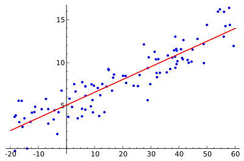
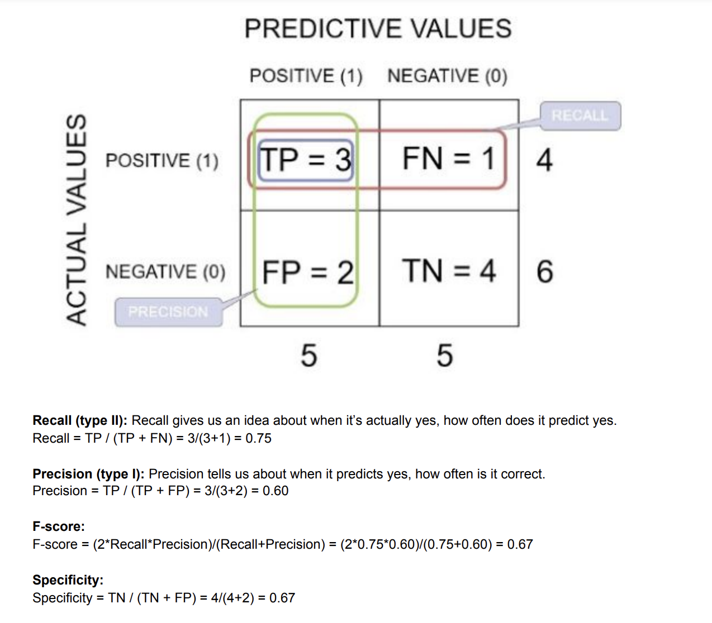

# Modeling

# Frame business problems as machine learning problems

**Determine when to use/when not to use ML**

ML does not resolve all problems, ML cannot be applied when: no data, no labels, needs to be launched quickly, no tolerance for mistakes 

When is it applicable? Persistent problems, solutions at scale, personalization, not trivial to program, presents changes over time. 

Define the scope: data, timeframe for training and expected output 

**ML Types**

- Supervised Learning
- Unsupervised learning
- Reinforcement Learning

**Models**

- Regression: predict numerical value
- Classification: predict a label (binary or multiclass)
- Recommendations: find relevant items based on past behavior
- Clustering: finding groups
- Anomaly detection: finding outliers

**ML Pipeline**

Business Problem → Data Collection →  Data Preparation  → Data Visualization → Feature Engineering 

# Select the appropriate model(s) for a given machine learning problem

## Xgboost

XGBoost is a popular and efficient open-source implementation of the **gradient boosted trees** algorithm. Gradient boosting is a **supervised** learning algorithm, which attempts to accurately predict a target variable by combining the estimates of a set of simpler, weaker models. the weak learners are regression trees, and each regression tree maps an input data point to one of its leafs that contains a continuous score. XGBoost minimizes a r**egularized (L1 and L2)** objective function that combines a convex loss function (based on the difference between the predicted and target outputs) and a penalty term for model complexity (in other words, the regression tree functions).

## linear regression

## logistic regression

## Clustering

### hierarchical

### elbow plot

### kmeans

The k-means clustering algorithm mainly performs two tasks:

- Determines the best value for K center points or centroids by an iterative process.
- Assigns each data point to its closest k-center. Those data points which are near to the particular k-center, create a cluster.
- Use the **“elbow method”** on a plot of the total within-cluster sum of squares (**WSS**) as a function of k

## Collaborative Filtering

 is a generic approach that can be summarized as "using information
from similar users or items to predict affinity to a given item". There are many techniques
that can be used for Collaborative Filtering. The two that are most well-known and
discussed in the literature are **Nearest Neighbors (knn)** and **Matrix Factorization (MF)**. Knn
is clearly a supervised method. As for MF, depending on the details of its usage one can
call it supervised, unsupervised, or semi-supervised.

## KNN

supervised method 

1. Define distance
2. Choose K
3. Find the K nearest neighbors of the new observation to classify 
4. assign class label by majority vote 

Characteristics:

no-parametric - no equation 

too much computations-each time calculate distances 

save all dataset - very expensive

curse of dimensionality - the more features you have the more sparse  

## SVM

The **RBF kernel** works by mapping the data into a high-dimensional space by finding the dot products and squares of all the features in the dataset and then performing the classification using the basic idea of Linear SVM.

## Decision Trees

threshold and decisions are automatically

**entropy** = relative measure of disorder in the data 

disorder is present when the distinction between groups is not clear → entropy is high 

**IG information gane =** compare entropy before and after split → maximize IG 

prune tree to reduce overfitting 

Ensemble - Random Forest - create many decision trees and combine results 

## Bagging and Boosting

**Bagging** - boostrap aggregation 

each model uses different training data 

when use bagging? when high variance but low bias / reduce bias but keeps bias the same

**Boosting** - models in chain

when use boosting? high bias 

## Neural network architecture

- X perceptron
- **f activation function**: defines output of a node
    - sigmoid for logistic regression
    - relu for hidden layers (avoids "vanishing gradient")
    - leaky relu (to avoid dying relu)
    - PReLu
    - Maxout
    - linear for output layer in regression
    - softmax for output layer in multiple classification
    - RNN - tanh
- w weights
- circles nodes
- layers

**Fully-connected layers:** also known as linear layers, connect every input neuron to every output neuron and are commonly used in neural networks

### CNN

**convolutional layer**

**Padding ****is used to make dimension of output equal to input by *adding zeros to the input* 

**Stride** controls how filter convolves over input i.e., the *number of pixels shifts over the input matrix*. if stride is 2, filter moves 2 pixels at a time. 

**pooling layer**

It downsamples the output of the Convolutional layers by sliding the filter of some size with some stride size and calculating the maximum or average of the input.

Max-pooling : selects maximum element from the feature map. 

Average pooling : It involves average calculation for each patch of the feature map.

**common usage: Conv2D, MaxPooling2D, Dropout, Flatten, Dense, Dropout, Softmax** 

Architectures: ResNet(Residual networks), LetNet-5 (hand written), GoogleLNet , AlexNet (image classification) 

### Recurrent Neural Networks

**RNN** Connections between nodes can create a cycle, allowing output from some nodes to affect subsequent input to the same nodes.

time series , sequence data of arbitrary length

**Topologies**

- Sequence to Sequence
- Sequence to Vector
- Vector to Sequence
- Encoder and Decorder for example machine translation

### Long short-term memory - LSTM

has feedback connections.  

## Transformers

BERT - NLP model using transformer architecture 

GPT 

transfer learning - start with pre-trained model 

## Time Series

There are four types of time-series patterns:

- **Trend: Long-term increase or decrease in the data**. The trend can be any function, such as linear or exponential, and can change direction over time.
- **Seasonality:** Repeating cycle in the series with fixed frequencies (hour of the day, week, month, year, etc.). **A seasonal pattern exists of a fixed known period.**
- **Cyclicity:** Occurs when the data rise and fall, but without a fixed frequency and duration caused, for example, by economic conditions.
- **Noise:** The random variation in the series.

Seasonality + Trends + noise = time series / Seasonality * Trends * noise = time series 

# Train machine learning models

## Train-test-val split

## Cross-validation

- randomly partition data into k folds
- for each fold train model on k-1 folds and evaluate on the k
- then average all results
- the larger the k, more time to train, more variance
- smaller the k, more bias
- usually k between 5 and 10

- Variations:
    - leave 1 out - in small datasets (k=#instances)
    - stratified - preserve proportion

## Optimizer

**Gradient descent** 

minimize f(x)

start with random guess xo 

iterate xi+1=xi -yf’(xi)

stop after some condition is met:

- if value of x does not change more than certain cte
- a fixed number of steps
- other condition more complicated

what direction should be y to maximize f as quickly as possible? same direction to the gradient x = df/dx 

- maximize → decrease gradient
- minimize → decrease -gradient
- find local minima / max → gradient =0

**Newton’s method minimize f(x)**

# Computation

## GPU vs. CPU

While CPUs can process many general tasks in a fast, sequential manner, GPUs use parallel computing to break down massively complex problems into multiple smaller simultaneous calculations.

In each training iteration, typically a small subset of the dataset, called a mini-batch, is processed. When a single GPU is available, processing of the **mini-batch** in each training iteration is handled by this GPU. When training with multiple GPUs, the mini-batch is **split across** available GPUs to evenly spread the processing load. To ensure that you fully use each GPU, you **must increase the mini-batch size linearly with each additional GPU.**
Mini-batch size has an impact not only on training speed, but also on the quality of the trained model. As you increase the mini-batch size, it is important to **tune other hyperparameters** to ensure faster training with similar model quality.

## Transfer learning

extend the network with more layers at the end 

**not** re-train the original model

## Fine Tuning

requires that we not only *update* the architecture but also ***re-train*** it to learn new object classes.

## Production environments

- batch predictions - historical data offline
- online predictions - real time predictions
- online training - train online the model, when data change often

# Perform hyperparameter optimization

## Regularization

- **Drop out:** **Dropout is a regularization technique** for reducing overfitting in neural networks by preventing complex co-adaptations on training data. It is a very efficient way of performing model averaging with neural networks. The term "dropout" refers to dropping out units (both hidden and visible) in a neural network
- **L1 - Lasso  - norm 1 :** (Least Absolute Shrinkage and Selection Operator). if *lambda* is zero then we will get back OLS whereas **very large value will make coefficients zero hence it will under-fit.** The key difference between these techniques is that Lasso shrinks the less important feature’s coefficient to zero thus, removing some feature altogether. So, this **works well for** **feature selection** in case we have a huge number of features.

- **L2 - Ridge - norm 2 : if *lambda* is very large then it will add too much weight and it will lead to under-fitting.** Ridge regularization, tends to keep the coefficients less important features tiny rather than zero them out. This **works well to avoid overfitting.**

cost function for L2

## Learning rate

large learning rate tend to overshoot the solution

small learning rate increase learning time 

### Batch size

- **small batch size tend to get stuck local minima**
- large match size can converge in the wrong solution - Large batch sizes tend to get stuck, at random, inside "local minima" instead of the correct solution.
- if you have small batch size , you need small learning rate

## Model initialization

- Tree-based models (# of trees, # of levels)
- Linear models (learning rate)
- GridSearch - finding the best combination of parameters
- RandomSearch

## Vanish Gradient Problem

when the slope is close to zero becomes a problem 

- multi-level heirarchy - train in separate levels
- use LSTM or RNN
- use **relu** as activation function
- gradient checking - debugging

# Evaluate machine learning models

## Metrics for Classification

**accuracy:** proportion of correctly classified = TP+TN/(TP+FP+TN+FN)

**precision(Type I):** What proportion of positive identifications was actually correct? = TP/(TP+FP) good choice when you care about false positives (medical tests, drug tests)

**recall (Type II) = sensitivity = completeness = TPR :** percentage of ****actual positives that was identified correctly = TP/(TP+FN) good choice when you care about false negatives (for example fraud)

**False Positive Rate:** ratio between false positives and the actual negatives = FP/(FP+TN)

**F1 score** 

F1score = 2tp/(2tp+ fp + fn)

**AUC-ROC**

AUC (**Area Under The Curve**): represents the degree or measure of separability. It tells how much the model is capable of distinguishing between classes. Higher the AUC, the better the model is at predicting 0 classes as 0 and 1 classes as 1.

useful for compare different classifiers together 

- AUC values near **1** indicate an ML model that is highly accurate.
- Values near **0.5** indicate an ML model that **is no better than guessing at random**.
- Values near **0** are unusual to see, and typically indicate a problem with the data.

The AUC can also be generalized to the multi-class setting

ROC (**Receiver Operating Characteristics)** is a probability curve. 

TPR = recall = TP/(TP+FN)

 FPR = 1 - Specificity = FP/(FP+TN)

Specificity = FP/(TN + FP)

**Confusion matrix**

## Mertics for regression

**Loss function** 

**Residuals** Residual = actual - predicted 

measure of how far away a point is vertically from the regression line.

**Residual Plot** 

residual values in y axis and independent variable in x axis 

If the residuals are randomly scattered around the residual = 0, it means that a **linear model** approximates the data points well without favoring certain inputs. In such a case, we conclude that a linear model is appropriate. (graph 1)

If the residuals show a curved pattern, it indicates that a linear model captures the trend of some data points better than that of others. In such a case, we should consider using a model other than a linear model.(graph 2)

**R-squared**

**MSE** 

**RMSE:** root-mean-square error 

# Avoid Overfitting strategies

- **Overfitting:** model is too complex, fits the training data too well (high variance)
- **Underfitting:** model is too simple, not uses enough features (high bias)
- **Bias:** diff average between model predictors to target values
- **Variance:** is the variation of predictions across different training data points

1. **Get more data:** the more the better. A model trained on more complete data will naturally generalize bette
2. **Data augmentation for images:** making small changes like rotations, adding bright and others.
3. **Umbalaced datasets:**
    
    ](Modeling/Untitled%2033.png)
    
    [https://blog.strands.com/unbalanced-datasets](https://blog.strands.com/unbalanced-datasets)
    
    1. **Undersampling:** removing items from the biggest class to keep the same amount of items for all classes. 
    2. **Oversampling:** 
        - Random Oversampling: add multiple copies of some of the minority classes.
        - SMOTE: Synthetic Minority Over-sampling Technique: ‘data augmentation for tabular data’ creating new samples from the minority class. KNN
        - GAN (Generative Adversial Networks) - generates unique observations that
        more closely resemble the minority without being so similar that they are
        almost identical.
4. **Adjusting threshold in classification** 
5. **Feature selection** 
6. **Regularization technique  - increase**  
7. **Early stopping** 

## Techniques to reduce underfitting

1. Increase model complexity
2. Increase number of features, performing feature engineering.
3. Remove noise from the data.
4. Increase the number of epochs or increase the duration of training to get better
results.

# Terminology

- label=target=outcome=class=dependent variable=response
- features=independent variables=attributes=predictors
- dimensionality=number of features
- Model selection → choose the best model
- labeling: obtain corresponding output for a row of data
- Correlation does not mean causation: Even if there is a correlation between two variables, we cannot conclude that one variable causes a change in the other
- sampling: get a subset of data that is representative for the population. It can be random or stratified (maintain proportion)

[Continue to SageMaker section](SageMaker.md)