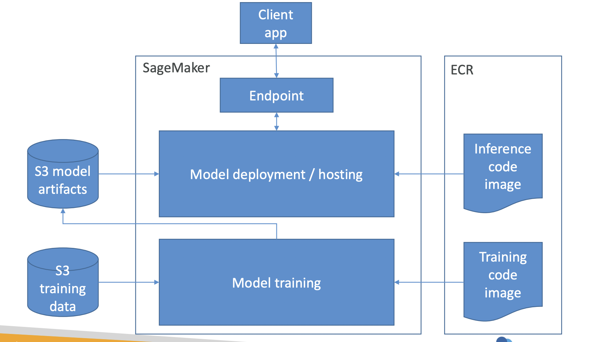
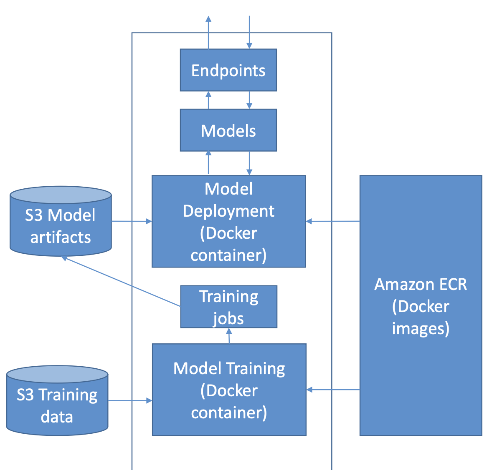
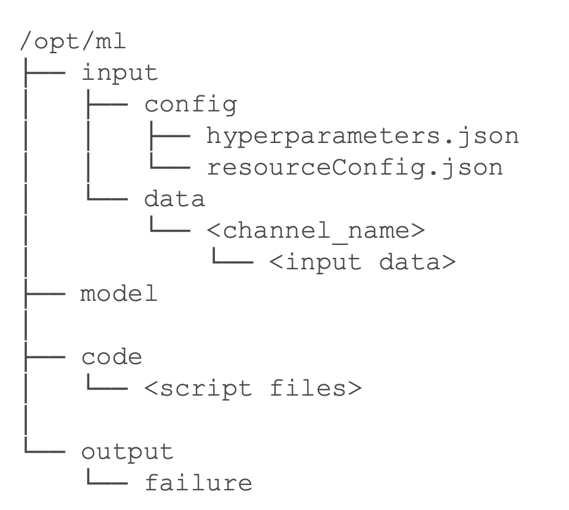

# SageMaker

# **What is SageMaker?**

A fully managed machine learning service for building and train machine learning models and deploy them into production. 

Integration with Jupyter notebook. 

large scale

complete ML pipeline 




# Amazon SageMaker Feature Store

**Feature Store:** Serves as the single source of truth to store, retrieve, remove, track, share, discover, and control access to features.

- online store: low latency, high availability. allows quick access to the latest value
- offline store: used when low latency is not needed. Stores in S3.

# Input data/ Streaming

- **CSV (libsvm):** Amazon SageMaker requires that a CSV file does not have a header record and that the target variable is in the first column.
- **optimized protobuf recordIO:** allows to run in **pipe mode** and optimize performance when training.  By streaming in your data directly from Amazon S3 in Pipe mode, you reduce the size of Amazon Elastic Block Store volumes of your training instances.
- Amazon SageMaker supports Amazon Simple Storage Service (Amazon S3), Amazon Elastic File System (Amazon EFS), and Amazon FSx for Lustre.
- By default - The IAM role automatically gets permissions to access any S3 bucket that has sagemaker in the name

## **Input mode**

- ***File mode:*** presents a file system view of the dataset to the training container. This is the **default** input mode if you don't explicitly specify one of the other two options. If you use file mode, SageMaker downloads the training data from the storage location to a **local** directory in the Docker container. Speed depends on the size of dataset, the average size of files, and the number of files. For distributed training, you can shard the dataset across multiple instances with the `ShardedByS3Key` option.
- ***Fast file mode:*** provides file system access to an **Amazon S3**. At the start of training, fast file mode identifies the data files but does not download them. It streams S3 content **on demand** as your training script consumes data. This means that your dataset no longer needs to fit into the training instance storage space as a whole, and you don't need to wait for the dataset to be downloaded to the training instance before training starts. In contrast to pipe mode, fast file mode works with random access to the data. However, it works best when data is read **sequentially**. Fast file currently supports S3 prefixes only (it does not support manifest and augmented manifest). Fast file mode is compatible with SageMaker local mode.
- ***Pipe mode:*** **streams** data directly from an Amazon S3 data source using First-In-First-Out (FIFO) pipe. Streaming can provide faster start times and better throughput than file mode. When you stream the data directly, you can reduce the size of the Amazon EBS volumes used by the training instance. Pipe mode needs only enough disk space to store the final model artifacts. Pipe mode also supports **managed sharding and shuffling of data.**

# Data Wrangler

implify the process of data preparation and feature engineering, and complete each step of the data preparation workflow. 

**Import → Data Flow → Transform → Generate Data Insights → Analyze → Export** 

SageMaker Data Wrangler contains over 300 built-in data transformations so you can quickly transform data without writing any code.

(similar to Glue but within SageMaker Studio)

# Bias and Fairness - Model explainability

**Amazon SageMaker Clarify:** You can use Amazon SageMaker Clarify to determine whether data used for training models encodes any **bias**. 

- pretraining bias metrics
- posttraining bias metrics
- **SHAP** values for explainability: contribution that each feature made to model predictions.
- Partial dependence plots (PDP): relationship between features and predictions. Show the dependence between the target response and a set of input features of interest

```python
from sagemaker import clarify
clarify_processor = clarify.SageMakerClarifyProcessor(role=role,
instance_count=1,
instance_type='ml.c5.xlarge',
max_runtime_in_seconds=1200,
volume_size_in_gb=100)
```

`"**dataset_type**"` – (Required) Format of the dataset. Valid values are `"text/csv"`
 for CSV, `"application/jsonlines"`
 for JSON Lines, `application/x-parquet`
 for Apache Parquet, and `application/x-image`

M**etrics** 

- Class imbalance (CI)
- Difference in Positive Proportions in Predicted Labels (DPPL) - difference between a and d
- Disparate Impact (DI) - Ratio
- KL, JS: how much outcome distributions of facets diverge
- LP-norm: p-norm difference between distributions of outcomes from facets
- TVD: L1-norm difference between distributions of outcomes from facets
- KS: max divergence between outcomes in distributions from facets
- CDD: disparity outcomes between facets as a whole , and by subgroups
- Conditional Demographic Disparity in Predicted Labels (CDDPL) - disparity as a whole and subgroups

## SageMaker JumpStart

one click models and algorithms from **model zoo** , over 150 open source models 

## SageMaker Edge Manager

Software agent for edge devices, model optimized with **SageMaker Neo**, collects and samples data for monitoring, labeling, retraining 

## SageMaker Canvas

**no-code** machine learning for BA 

upload CSV data

Can also join data 

automatic cleaning 

## Amazon SageMaker Model Building Pipelines

Amazon SageMaker Model Building Pipelines is a tool for building machine learning pipelines that take advantage of direct **SageMaker integration**. 

The pipeline definition encodes a directed acyclic graph (DAG) that can be exported as a JSON definition. This **DAG** gives information on the requirements for and relationships between each step of your pipeline. The structure of a pipeline's DAG is determined by the data dependencies between steps.

With **EventBridge**, you can automate your pipeline executions and respond automatically to events such as training job or endpoint status changes. 

With the Amazon **Experiments** integration you can compare metrics such as model training accuracy across multiple pipeline executions just as you can compare such metrics across multiple run groups of a SageMaker model training experiment.

# Built-in algorithms

## Time series

### 1. **Amazon SageMaker DeepAR**

**Forecasting algorithm** is a supervised learning algorithm for forecasting scalar (one-dimensional) **time series using recurrent neural networks (RNN).** Classical forecasting methods, such as autoregressive integrated moving average **(ARIMA)** or exponential smoothing **(ETS),** fit a single model to each individual time series. They then use that model to extrapolate the time series into the future.

always include all dataset for training, testing and inference

don´t use large values for prediction 

hyperparameters: context lenght, epocs, mini_batch_size, learning rate, num_cells

CPU or GPU

## Tabular data

### 1. **Amazon XGBoost**

ensemble of estimates from a set of simpler and weaker models.

**Key hyper parameters**

- Required **num_round**: number of rounds to turn the training
- Required when objective is set to ulti:softmax (or multi:softprob): **num_class**: number of classes

**Optional parameters:** 

- alpha: L1 (lasso), lambda: L2 (ridge),  gamma (loss reduction to make partition on a leaf node) Increasing these value makes the model more conservative.
- booster: “gbtree” by default or “dart”
- Csv_weight: If 1 (enabled), XGboost differentiates the importance of instances for csv
input by taking the second column (after labels).
- early_stopping_rounds
- eta: [0,1] range with 0.3 default. step size shrinkage for feature weights to make the boosting process more conservative.
- eval_metric: “rmse” for regression, “error” for classification and “map” for ranking.
- **subsample**: [0,1] range. Default is 1. subsample ratio of the training instance. Setting it to
0.5 means that XGboost randomly collects half of the data instances to grow trees. **This prevents overfitting.**
- objective: Specifies the learning task and the corresponding learning
- max_depht

input csv  

XGBoost 1.0-1 or earlier only trains using CPUs - M5
SageMaker XGBoost version 1.2 or later supports single-instance GPU training. (setting gpu_hist) - P2 and P3

### 2. LightGBM

LightGBM an implementation of the gradient-boosted trees algorithm that adds two novel techniques for improved efficiency and scalability: Gradient-based One-Side Sampling (GOSS) and Exclusive Feature Bundling (EFB)

input csv 

### 3. **CatBoost**

An implementation of the gradient-boosted trees algorithm that introduces **ordered boosting** and an innovative algorithm for processing **categorical features**.

input csv

only CPU

### 4. AutoGluon-Tabular

**AutoML** framework that succeeds by ensembling models and stacking them in multiple layers.

input csv

### 5. **K-means**

K-means is an **unsupervised learning algorithm**. It attempts to find **discrete k groupings within data**, where members of a group are as similar as possible to one another and as different as possible from members of other groups. You define the attributes that you want the algorithm to use to determine similarity.

measured by Euclidian distance. 

test data is optional

**train channel ShardedByS3Key , test FullyReplicated** 

**Expects tabular data** `recordIO-wrapped-protobuf`and `CSV`
 

kmeans++ approach - make initial cluster centers as far as possible 

choosing k value - elbow method 

### 6. **Factorization Machines Algorithm**

The [Factorization Machines](https://docs.aws.amazon.com/sagemaker/latest/dg/fact-machines.html) algorithm is a general-purpose **supervised** learning algorithm that you can use for both **classification and regression tasks**. It is an extension of a linear model that is designed to capture interactions between features within high dimensional sparse datasets economically. Factorization machines are a good choice for tasks dealing with **high dimensional sparse datasets**, such as click prediction and item recommendation.

`recordIO-protobuf`format with `Float32` NOT CSV 

binary classification (Binary cross entropy - Log loss, Accuracy, F1 Score) or regression (RMS), not multi-class

**good for recommendation system , click prediction , predict if a person likes this product or not**

limited to pair-wise interactions 

NOT good csv to represent data  - instead a matrix 

recommend CPU 

GPU works with dense data 

### 7. **Linear learner**

[Linear Learner](https://docs.aws.amazon.com/sagemaker/latest/dg/linear-learner.html) linear models are supervised learning algorithms used for solving either **classification or regression** problems. For input, you give the model labeled examples (x, y). x is a high-dimensional vector and y is a numeric label. 

training data should be **normalized** **and shuffle** 

train multiple models in parallel 

L1 and L2 regularization

`recordIO-wrapped protobuf` and `CSV`

no more than 1 GPU

num_classes and predictor type Required parameters

### 8. TabTransformer

[TabTransformer](https://docs.aws.amazon.com/sagemaker/latest/dg/tabtransformer.html) a novel deep tabular data modeling architecture built on self-attention-based Transformers.

input text / csv 

### 9. **KNN**

Amazon SageMaker k-nearest neighbors (k-NN) algorithm is an **index-based algorithm.** It uses a **non-parametric** method for classification or regression. 

- For classification problems, the algorithm queries the k points that are closest to the sample point and returns the **most frequently** used label of their class as the predicted label.
- For regression problems, the algorithm queries the k closest points to the sample point and returns the **average** of their feature values as the predicted value.
- Sagemaker includes dimensionality reduction - avoid sparse data - curse of dimensionality
- important parameters: K and sample size
- `text/csv` and `application/x-recordio-protobuf`

## Text data

### 1. **Amazon SageMaker Sequence to Sequence Seq2Seq**

Supervised learning algorithm where the input is a sequence of tokens (for example, text, audio) and the output generated is another sequence of tokens.

expects **Record io protobof** 

tokenize files 

machine translation

optimizers: blue score ‘- to compare against multiple translations  

### 2. **Object2Vec**

The Amazon SageMaker Object2Vec algorithm is a general-purpose neural **embedding** algorithm that is highly customizable. It can learn low-dimensional dense embeddings of high-dimensional objects. The embeddings are learned in a way that preserves the semantics of the relationship between pairs of objects in the original space in the embedding space. 

- **EC2** instance recommended for Object2Vec
- Object2Vec **generalizes the well-known Word2Vec** embedding technique for words that is optimized in the SageMaker BlazingText algorithm.
- **Word2Vec embeddings**: words that are semantically similar are close together in the
embedding space
- needs tokenized tokens
- training data consist of pairs of attributes
- expects **JSON** input → choose 2 paths encoders
- hyperparameters: all hyperparameters for neural networks
- INFERENCE_PREFERED_MODE to optimize encoder embeddings
- 

### 3. **BlazingText**

**Word2vec and text classification algorithms.** Downstream natural language processing (NLP) tasks, such as sentiment analysis, named entity recognition, machine translation. 

A **downstream** task is a fine-tuned transformer task that inherited the model and parameters from a pretrained transformer model. 

Supervised mode -  text classification  

Object2Vec vs Blazing Text: 

- Blazing Text can only find relationships between **individual words, not entire documents**
- Object2Vec can find embeddings for arbitrary object.
- **The order of labels within the sentence doesn't matter.**
- Expects **text**

### 4. **LDA**

The Amazon SageMaker **Latent Dirichlet Allocation** (LDA) algorithm is an unsupervised learning algorithm that attempts to **describe a set of observations as a mixture of distinct categories.** LDA is most commonly used to **discover a user-specified number of topics shared by documents within a text corpus**. Here each observation is a document, the features are the presence (or occurrence count) of each word, and the categories are the topics. Since the method is unsupervised, the **topics are not specified up front**, and are not guaranteed to align with how a human may naturally categorize documents. The topics are learned as a probability distribution over the words that occur in each document. Each document, in turn, is described as a mixture of topics.

**To improve performances, use PIPE mode with RecordIO format.**
DON’T use multiple GPU - LDA only supports training on a **single-instance CPU**

### 5. **NTM**

Amazon SageMaker NTM is an unsupervised learning algorithm that is used to **organize a corpus of documents into topics that contain word groupings based on their statistical distribution.** only the number of topics, not the topics themselves, are prespecified.

NTM training supports both GPU and CPU instance type 

### 6. **Text Classification - TensorFlow**

The [Amazon SageMaker Text Classification](https://docs.aws.amazon.com/sagemaker/latest/dg/text-classification-tensorflow.html) - TensorFlow algorithm is a supervised learning algorithm that supports transfer learning with many pre-trained models from the TensorFlow Hub. **Even if a large amount of text data is not available**. 

Training datasets must be in **CSV format**.

**Amazon SageMaker Random Cut Forest (RCF)**

**Unsupervised** algorithm for detecting **anomalous** data points within a data set. (classifying as fraudulent or not).  

Although the algorithm could technically run on GPU instance types it does not take advantage of GPU hardware.

## IP Insights

learns the usage patterns for IPv4 addresses. It is designed to capture associations between IPv4 addresses and various entities, such as user IDs or account numbers.

identify suspicious behaviour

csv data: entity, IP address 

generates false cases during training 

neural network  

## Computer Vision

SageMaker provides image processing algorithms that are used for image classification, object detection, and computer vision.

- Image Classification: MXNet , Tensorflow
- Object Detection: MXNet, Tensorflow
- Semantic Segmentation Algorithm—provides a fine-grained, pixel-level approach to developing computer vision applications.

## Reinforcement Learning

define Objective, Environment, State, Action, Reward

SageMaker `RLEstimator` 

uses deep learning framework tensorflow and MXNet , supports coach and Ray Rllib toolkit 

distribute training across multi-core and multi-instances 

**Concepts** 

- Environment: layout
- state: where the player is
- action: move in a given direction
- reward: value associated with the action
- observation: state of chess board

## Dimension reduction

**Principal Components analysis PCA** 

**hyperparameters** 

algorithm_mode: 

- regular (for sparse data, moderate number of observations and features)
- randomized (for large number of observations and features, uses approximation algorithm)

substract_mean - unbias in data

| Model | File type |
| --- | --- |
| https://docs.aws.amazon.com/sagemaker/latest/dg/xgboost.html | CSV |
| https://docs.aws.amazon.com/sagemaker/latest/dg/lightgbm.html | CSV |
| https://docs.aws.amazon.com/sagemaker/latest/dg/catboost.html | CSV |
| https://docs.aws.amazon.com/sagemaker/latest/dg/autogluon-tabular.html | CSV |
| Factorization Machines | recordIO-protobuf |
| KNN | CSV |
| Linear Learner | CSV, recordIO-wrapped protobuf |
| TabTransformer | text , CSV |
| https://docs.aws.amazon.com/sagemaker/latest/dg/blazingtext.html | text |
| https://docs.aws.amazon.com/sagemaker/latest/dg/lda.html | CSV, recordIO-wrapped-protobuf |
| https://docs.aws.amazon.com/sagemaker/latest/dg/ntm.html | CSV, recordIO-wrapped-protobuf |
| https://docs.aws.amazon.com/sagemaker/latest/dg/object2vec.html |  |
| https://docs.aws.amazon.com/sagemaker/latest/dg/seq-2-seq.html | RecordIO-Protobuf |
| https://docs.aws.amazon.com/sagemaker/latest/dg/text-classification-tensorflow.html | CSV |
| https://docs.aws.amazon.com/sagemaker/latest/dg/deepar.html | JSON, parquet |
| https://docs.aws.amazon.com/sagemaker/latest/dg/ip-insights.html | text/csv |
| https://docs.aws.amazon.com/sagemaker/latest/dg/k-means.html | CSV, recordIO-wrapped-protobuf |
| https://docs.aws.amazon.com/sagemaker/latest/dg/pca.html | CSV, recordIO-wrapped-protobuf |
| https://docs.aws.amazon.com/sagemaker/latest/dg/randomcutforest.html | CSV, recordIO-wrapped-protobuf |

# Training

**Experiments** Amazon SageMaker experiment to track your machine learning (ML) workflows

**Supported frameworks:** Spark MMLib, Tensorflow, HuggingFace, pytorch, MxNet

**Local training:** Amazon SageMaker recently launched support for local training using the pre-built TensorFlow and MXNet containers

**Visualization charts for training:** [sagemaker.analytics](http://sagemaker.analytics) import TrainingJobAnalytics . 

metric names test:cross_entropy / test:msd

I**ncremental training**, you can use the artifacts from an existing model and use an expanded dataset to train a new model.

**SageMaker Training Compiler** is integrated into the AWS Deep Learning Containers (DLCs). You can compile and optimize training jobs on GPU instances with minimal changes to your code. 

- add`compiler_config=TrainingCompilerConfig()` to the SageMaker estimator class.
- Adjust hyperparameters (`batch_size`and `learning_rate`). Using a larger `batch_size` results in a better GPU utilization and reduces the total training time.
- `estimator.fit()`SageMaker compiles your model and starts the training job.
- enable debug compiler_config=TrainingCompilerConfig(debug=True)

can accelerate training up to 50%

incompatible SageMaker distributed training libraries 

**SageMaker Autopilot**

data must be tabular 

binary or multiclass classification problems 

Linear Learner , XGBoost , Deep Learning MLP 

integrates SageMaker Clarify 

**Storage Folders:** 

- SM_CHANNEL_*`CHANNEL_NAME`* `/opt/ml/input/data/*channel_name`*
- SM_OUTPUT_DIR `/opt/ml/output`
- `/opt/ml/model`
- Checkpoints `/opt/ml/checkpoints`
- SAGEMAKER_SUBMIT_DIRECTORY `/opt/ml/code`
- `/tmp`

**Checkpoints**

Using checkpoints, you can do the following:

- Save your model snapshots under training due to an unexpected interruption to the training job or instance.
- Resume training the model in the future from a checkpoint.
- Analyze the model at intermediate stages of training.
- Use checkpoints with SageMaker managed spot training to save on training costs.

**Augmented Manifest Files**

- To include metadata with your dataset in a training job.
- your dataset must be stored in Amazon Simple Storage Service (Amazon S3).
- You must configure your training job to use the dataset stored there.
- Specify the location S3Uri and format of this dataset for one or more Channel.
- Augmented manifests can only support Pipe input mode.
- If your training dataset is large, preprocessing can be time consuming and expensive.

****************************************Tips for training jobs:**************************************** 

- same ragion S3 bucket and training job
- SageMakerSearch compare results → bucket models
- run in parallel training jobs
- soft limit # instances

# Modeling

## Hyperparameter tuning

### Automatic “Hyperparameter tuning Job”

learns as it goes so you don’t have try every possible combinations 

**Best practices** 

- **don’t** try to optimize too many hyperparameters at once
- **limit ranges** to as small a range as possible
- use **logarithmic** scales when appropriate
- **don’t** run too many training jobs concurrently

### GridSearch

When using grid search, hyperparameter tuning chooses combinations of values from the range of categorical values that you specify when you create the job. **Only categorical parameters are supported** when using the grid search strategy. Y**ou do NOT need to specify the `MaxNumberOfTrainingJobs,`** automatically calculated to be the total number of distinct categorical combinations possible. If specified, the value of `MaxNumberOfTrainingJobs` **should equal the total number of distinct categorical combinations possible**.

### Random Search

When using random search, hyperparameter tuning chooses a random combination of values from within the **ranges** that you specify for hyperparameters for each training job it launches. Because the choice of hyperparameter values doesn't depend on the results of previous training jobs, you can run the maximum number of concurrent training jobs without affecting the performance of the tuning.

### Bayesian Optimization

Bayesian optimization treats hyperparameter tuning l**ike a** r**egression problem**. Given a set of input features (the hyperparameters), hyperparameter tuning optimizes a model for the metric that you choose. To solve a regression problem, hyperparameter tuning makes guesses about which hyperparameter combinations are likely to get the best results, and runs training jobs to test these values. 

**Hyperparameter tuning uses an Amazon SageMaker implementation of Bayesian optimization.**

### Hyperband

Hyperband is a multi-fidelity based tuning strategy that dynamically **reallocates** resources. Hyperband uses both intermediate and final results of training jobs t:

- re-allocate epochs to well-utilized hyperparameter configurations
- automatically stops those that underperform.
- early stopping: Training jobs can be stopped early when they are unlikely

### hyperparameter optimization (HPO)

- The **job settings:** warm starting, early stopping, and the tuning strategy.
- The **training job definition** to specify the name, algorithm source, objective metric, and the range of values.
- The **tuning job resources**: to deploy, including the maximum number of concurrent training jobs that a hyperparameter tuning job can run concurrently and the maximum number of training jobs that the hyperparameter tuning job can run.

**Create**

- From the console choose - **Create hyperparameter tuning job**
- From the API - JSON - **CreateHyperparameterTuning**: pass ranges for the parameters that you want to tune and the metric for your tuning job. Provide a TrainingJobDefinitions list

**Cloning** : Cloning copies all of the job’s settings, including data channels, S3 storage locations for output artifacts.

**Tagging**: Automatic Model Tuning launches multiple training jobs within a single parent tuning job to discover the ideal weighting of model hyperparameters

**EarlyStopping**: TrainingJobEarlyStoppingType = AUTO or early_stopping_type=Auto

**Warm Start**: Use warm start to start a hyperparameter tuning job using one or more previous tuning jobs as a starting point. Using information from previous hyperparameter tuning jobs can help increase the performance of the new hyperparameter tuning job by making the search for the best combination of hyperparameters more efficient. Warm start tuning jobs typically take longer to start than standard hyperparameter tuning jobs, because the results from the parent jobs have to be loaded before the job can start.

**Warm Pools**

Let you retain and **reuse** provisioned infrastructure after the completion of a training job to reduce latency for repetitive workloads. Training jobs that match specified parameters run on the retained warm pool infrastructure.

Set KeepAlivePeriodInSeconds >0 → time that the provisioned resources are kept alive in a warm

**Tips** 

- For large jobs, using Hyperband
- If runtime and resources are limited, use Random search or Bayesian optimization instead
- Grid search when you want to be able to reproduce results of a tuning job, or when it is important to explore the entire hyperparameter search space evenly.
- limit number of parameters
- limit ranges
- If you know that a hyperparameter is log-scaled and can convert it yourself
- Typically, running one training job at a time achieves the best results with the least amount of compute time.
- Design distributed training jobs so that the objective metric reported is the one that you want.

# integrate with Spark

preprocess data as normal in Spark 

Connect SageMaker Notebook to EMR Spark cluster 

Use sagemaker-spark library

SageMakerEstimator and then SparkMakeModel instead of using SparkMMLib 

inference in SageMaker 

# **Inference**

online inference - Lambda 

turn off when no using 

you can have more than one model in the container 

you can dynamically adjust the number of instances provisioned in response to changes in your workload

model.fit() → training 

tunner.fit() → tuning 

## **Amazon Elastic Inference (EI)**

**accelerates deep learning inferences with GPU**, elastic inference accelerator alongside a CPU instance. Can be applied to **docker containers and notebooks.**

## **Automatic scaling**

Automatic scaling ****for inference nodes. SageMaker distribute instances across multiple availability zones. use CloudWatch to determine how many instances do you need. (Automatic scaling uses the policy to increase or decrease the number of instances in response to actual workloads.). 

## multi-variant endpoints

With SageMaker multi-variant endpoints you can distribute endpoint invocation requests across multiple production variants by providing the traffic distribution for each variant, or you can invoke a specific variant directly for each request.

## **Serverless inference**

Serverless inference ****good if you don't know frequency of income traffic. **Charge by usage**. Automatically provisioned and scaled.  

## **Inference recommender**

 Recommends the best type of instance and configuration for your model 

## inference pipelines (pre-processing inference post processing )

To manage data processing and real-time predictions or to process **batch transforms in a pipeline**

Optimize model using Neo

To train TensorFlow, Apache MXNet, PyTorch, ONNX, and XGBoost models once and optimize them to deploy on ARM, Intel, and Nvidia processors

integrate with Glue or EMR 

# Scale in SageMaker

### **How to run ?**

- Built in algorithm
- Docker
- Script Mode

### **Distribute training**

SageMaker provides distributed training libraries and supports various distributed training options for deep learning tasks such as computer vision (CV) and natural language processing (NLP).

```python

*from sagemaker.framework import Framework

estimator = Framework(
    ...,
    instance_count=2,
    instance_type="ml.p4d.24xlarge",
    distribution={"smdistributed" : {"dataparallel" : {"enabled" : True}}}
)*
```

**Where to run?**

- **Single instance -** Horovod - sub-linear performance
- **Multi instance -** Set ****global_step=tf.train.get_gloabal_step() in the optimizer
    - Fully replicated: copy whole data to each EC2 instance
    - sharded data in chuncks in S3: why? big amount of data and to faster training

**SageMaker's Data Parallelism Library**

AllReduce, node-to-node communication, increase speed by up to 25% → near-linear performance. 

SageMaker distributed training libraries are available only through the AWS deep learning containers. 

example when to use it: *BERT, MaskRCNN*

**SageMaker's Model Parallelism Library**

 Use Amazon SageMaker's model parallel library to train large deep learning (DL) models that are difficult to train due to GPU memory limitations.

### **Train Using a Heterogeneous Cluster**

Using the heterogeneous cluster feature of SageMaker Training, you can run a training job with **multiple types of ML instances** for a better resource scaling and utilization for different ML training tasks and purposes. 

### Spot training

Managed Spot Training uses Amazon EC2 Spot instance to run training jobs instead of on-demand instances. You can specify which training jobs use spot instances and a stopping condition that specifies how long SageMaker waits for a job to run using Amazon EC2 Spot instances. Metrics and logs generated during training runs are available in CloudWatch.

Create training job and set EnableManagedSpotTraining = True

You can calculate the savings from using managed spot training using the formula

 `(1 - (BillableTimeInSeconds / TrainingTimeInSeconds)) * 100`

# **Monitoring**

All SageMaker actions, with the exception of InvokeEndpoint, are logged by CloudTrail and are documented in the Operations. For example, calls to the CreateTrainingJob, CreateEndpoint and CreateNotebookInstance actions generate entries in the CloudTrail log files.

**SageMaker Debugger** saves internal model state at periodical intervals , set up alerts , SageMaker Studio Debugger dashboards 

built-in rules: 

- monitor system bottlenecks
- profile model framework operations
- debug model parameters

supported frameworks - tensorflow, pytorch, mxnet xgboost 

profiling system resource usage and training 

built-in actions: StopTraining, Email, SMS

interactive reports. SageMaker Debugger graphs, use debugger with custom training containers  

**SageMaker Model Monitor**

metrics emitted to **CloudWatch**, Get alerts on quality deviations via CloudWatch 

Visualize data drift (relative to a baseline), drift in model (Ground Truth labels), bias drift (integrates with SageMaker Clarify ), feature attribution drift (NDCG score compares to live data)

Detect anomalies and outliers , detect new features 

no code needed 

data is stored in S3 

integrates Tensorboard, Tableu 

# MLOps

Create end-to-end ML solutions with CI/CD by using SageMaker projects.

## **SageMaker Projects**

Help organizations set up and standardize developer environments. 

can provision SageMaker Projects from the AWS Service Catalog

When Should You Use a SageMaker Project? **collaboration** in a team , manage git repository

integration with CodePipeline or Jenkins pipelines 

## **Amazon SageMaker ML Lineage Tracking**

Creates and stores information about the steps of a machine learning (ML) workflow from data preparation to model deployment. 

**Reproduce the workflow steps,** track runining history, model and dataset lineage, and establish model governance

Create an **MLOps** project using Amazon SageMaker Studio.

**Tracking entities** maintain a representation of all the elements of your end-to-end machine learning workflow. You can use this representation to establish model governance, reproduce your workflow, and maintain a record of your work history.

## Docker

pre-built for deep learning models using Tensorflow, MXNet, PyTorch, Chaniner, Hugging Face, scikit-learn, Spark ML. 

Avoid using the `:latest`tag for production purposes.

XGBoost - do not use :1 or :latest tag , need to use one of the supported versions 

you can extend a pre-built container create another image using Dockerfile

you can adapt your images to run on SageMaker 

**Deep Graph Neural Networks** - DGL library is available as a deep learning container in Amazon ECR. Select deep learning containers when you write your estimator function in an Amazon SageMaker notebook.

**→** All models in SageMaker are hosted in Docker containers, exposes  a **flask application** 

- Pre-built deep learning,  scikit-learn and Spark ML, Tensorflow, MXNet, Chainer, PyTorch
- Distributed training via **Horovod** or **Parameter Servers**
- OR Your own training and inference code! Or extend a pre-built image.
- Expects data in S3



Library for making containers compatible with SageMaker

```python
RUN pip install sagemaker-containers in your Dockerfile
```



 `/opt/ml
 └── model`
     `└── <model files>`

WORDIR 

nginx.conf
• [predictor.py](http://predictor.py/) • serve/
• train/
• [wsgi.py](http://wsgi.py/)

```python
FROM tensorflow/tensorflow:2.0.0a0
RUN pip install sagemaker-containers
# Copies the training code inside the
container
COPY train.py /opt/ml/code/train.py
# Defines train.py as script entrypoint
ENV SAGEMAKER_PROGRAM train.py
```

**Using your own image**

```python
• cd dockerfile
• !docker build -t foo .
• from sagemaker.estimator import Estimator
estimator = Estimator(image_name=‘foo', role='SageMakerRole',
train_instance_count=1, train_instance_type='local')
estimator.fit()
```

Containers need to implement a web server that responds to `/invocations` and `/ping` on port 8080.

• A customer's model containers must accept socket connection requests within 250 ms.

**Production Variants**
test out multiple models on live traffic using Production Variants

run in parallel 2 models to see how they behave, distributing traffic among them 

this might be useful when putting in production a new version of the model 

BUT Offline validation isn’t always useful

## Kubernetes

SageMaker training and inference jobs with SageMaker Operators for Kubernetes and SageMaker Components for Kubeflow Pipelines. 

Kubeflow Pipelines (KFP) is a platform for building and deploying portable, scalable machine learning (ML) workflows based on Docker container. 

### SageMaker Neo

train once run anywhere - run locally a simulation

optimizes code for specific devices 

you can deploy to IoT Greengrass

# **Security**

**VPC**

training jobs run in a VPC 

notebooks are internet-enabled by default - for example downloading data or libraries from internet - but if you disable internet access need to configure PrivateLink  

training and inferences containers also internet enabled by default 

**IAM**

user permissions such as CreateTrainingJob, CreateModel, CreateEndpointConfig

Predefined policies: SageMakerReadOnly, SageMakerFullAccess

**Health of instances** 

register metrics CPU, memory, ground through , invocations, latency , log files 

**Amazon SageMaker Studio** uses filesystem and container permissions for access control and isolation of Studio users and notebooks. This is one of the major differences between Studio notebooks and SageMaker notebook instances.

**Root access:** By default, when you create a notebook instance, users that log into that notebook instance have root access. To disable call UpdateNotebookInstance operations, set the RootAccess field to Disabled.

**Encryption:** Amazon SageMaker Studio notebooks and SageMaker notebook instances, along with your model-building data and model artifacts, *by default* encrypts the notebooks, as well as output from Training and Batch Transform jobs. Encrypts using AWS Managed Key for Amazon S3, which cannot be shared cross-account. For cross-account configure customer managed key. 

**Amazon SageMaker geospatial** capabilities encrypts all your data, and results from jobs. 

**Protecting data in transit -** when creating training job enable **inter-container encryption** (checkbox or can be specified by SageMaker API). For use cases in the healthcare sector, the best practice for security is to encrypt communication between the nodes.

[Continue to MLOps section](MLOps.md)