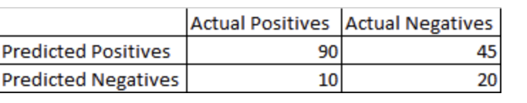

# Example questions Udemy course

**You wish to use a SageMaker notebook within a VPC. SageMaker notebook instances are Internet-enabled, creating a potential security hole in your VPC. How would you use SageMaker within a VPC without opening up Internet access?**
• Uncheck the option for Internet access when creating your notebook instance, and it will handle the rest automatically.
• No action is required, the VPC will block the notebook instances from accessing the Internet.
• Disable direct Internet access when specifying the VPC for your notebook instance, and use VPC interface endpoints (PrivateLink) to allow the connections needed to train and host your model. Modify your instance's security group to allow outbound connections for training and hosting.
• Use IAM to restrict Internet access from the notebook instance.

**You are developing a computer vision system that can classify every pixel in an image based on its image type, such as people, buildings, roadways, signs, and vehicles. Which SageMaker algorithm would provide you with the best starting point for this problem?**
• Semantic Segmentation
• Rekognition
• Object2Vec
• Object Detection

**You are developing an autonomous vehicle that must classify images of street signs with extremely low latency, processing thousands of images per second. What AWS-based architecture would best meet this need?**
• Develop your classifier using SageMaker Object Detection, and use Elastic Inference to accelerate the model's endpoints called over the air from the vehicle.
• Develop your classifier with TensorFlow, and compile it for an NVIDIA Jetson edge device using SageMaker Neo, and run it on the edge with IoT GreenGrass.
• Use Amazon Rekognition on AWS DeepLens to identify specific street signs in a self-contained manner.
• Use Amazon Rekognition in edge mode

Explanation: SageMaker Neo is designed for compiling models using TensorFlow and other frameworks to edge devices such as Nvidia Jetson. The **low latency** requirement requires an **edge solution**, where the classification is being done within the vehicle itself and not over the air. Rekognition (which doesn't have an "edge mode," but does integrate with DeepLens) can't handle the very specific classification task of identifying different street signs and what they mean.

**You are developing a machine learning model to predict house sale prices based on features of a house. 10% of the houses in your training data are missing the number of square feet in the home. Your training data set is not very large. Which technique would allow you to train your model while achieving the highest accuracy?**
• Impute the missing values using deep learning, based on other features such as number of bedrooms
• Impute the missing square footage values using kNN
• Drop all rows that contain missing data
• Impute the missing values using the mean square footage of all homes

**Your automatic hyperparameter tuning job in SageMaker is consuming more resources than you would like, and coming at a high cost. What are TWO techniques that might reduce this cost?**
• [x] Use logarithmic scales on your parameter ranges
• [ ] Use more concurrency while tuning
• [x] Use less concurrency while tuning
• [ ] Use linear scales on your parameter ranges
• [ ] Use inference pipelines

**A system designed to classify financial transactions into fraudulent and non-fraudulent transactions results in the confusion matrix below. What is the recall of this model?**

Response: 90% 

**After training a deep neural network over 100 epochs, it achieved high accuracy on your training data, but lower accuracy on your test data, suggesting the resulting model is overfitting. What are TWO techniques that may help resolve this problem?**
• [ ] Use more layers in the network
• [x] Use early stopping
• [ ] Employ gradient checking
• [ ] Use more features in the training data
• [x] Use dropout regularization

**A large news website needs to produce personalized recommendations for articles to its readers, by training a machine learning model on a daily basis using historical click data. The influx of this data is fairly constant, except during major elections when traffic to the site spikes considerably. Which system would provide the most cost-effective and simplest solution?**
• Publish click data into Amazon S3 using Kinesis Firehose, and process the data nightly using Apache Spark and MLLib using reserved instances in an EMR cluster. Publish the model's results to DynamoDB for producing recommendations in real-time.
• Publish click data into Amazon S3 using Kinesis Streams, and process the data in real time using Splunk on an EMR cluster with spot instances added as needed. Publish the model's results to DynamoDB for producing recommendations in real-time.
• Publish click data into Amazon S3 using Kinesis Firehose, and process the data nightly using Apache Spark and MLLib using spot instances in an EMR cluster. Publish the model's results to DynamoDB for producing recommendations in real-time.
• Publish click data into Amazon Elasticsearch using Kinesis Firehose, and query the Elasticsearch data to produce recommendations in real-time.

**You are training an XGBoost model on SageMaker with millions of rows of training data, and you wish to use Apache Spark to pre-process this data at scale. What is the simplest architecture that achieves this?**
• Use Amazon EMR to pre-process your data using Spark, and then use AWS Data Pipelines to transfer the processed training data to SageMaker
• Use Amazon EMR to pre-process your data using Spark, and use the same EMR instances to host your SageMaker notebook.
• Use the sparkmagic (PySpark3) kernel to pre-process your data within a SageMaker notebook, transform the resulting Spark DataFrames into RecordIO format, and then use Spark's XGBoost algorithm to train the model.(Incorrect)
• Use sagemaker_pyspark and XGBoostSageMakerEstimator to use Spark to pre-process, train, and host your model using Spark on SageMaker.

The SageMakerEstimator classes allow tight integration between Spark and SageMaker for several models including XGBoost, and offers the simplest solution. You can't deploy SageMaker to an EMR cluster, and XGBoost actually requires LibSVM or CSV input, not RecordIO.