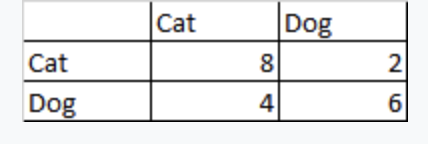

# Udemy Exam

1. You are analyzing Tweets from some public figure, and want to compute an embedding that shows past Tweets that are semantically similar to each other. Which tool would be best suited to this task?
• SageMaker Factorization Machines
• Amazon Transcribe
• SageMaker Object2Vec
• SageMaker BlazingText in word2vec mode

1. You are training SageMaker's supervised BlazingText using file mode. Which is an example of a properly formatted line within the training file?
• __label4 linux ready for prime time, intel says.
• __label__4 linux ready for prime time , intel says .
• __label__4 Linux ready for prime time, Intel says.
• __label__4 linux ready for prime time, intel says.
2. Your training data contains hundreds of features, many of which are correlated. You are having difficulty converging on a useful model due to the sparsity caused by hundreds of dimensions. How might you best pre-process this data to avoid this "curse of dimensionality?"
• Apply a factorization machine to the training data
• Apply PCA to the training data
• Drop half of the feature columns
• Concatenate columns together
3. You've developed a custom training model for SageMaker using TensorFlow, but a single GPU can't handle the data it needs to train with. How would you go about scaling your algorithm to use multiple GPU's within SageMaker?
• This isn't possible with Tensorflow; use Apache MXNet instead.
• Write your model with the Horovod distributed training framework, which is supported by SageMaker.
• Deploy your model to multiple EC2 P3 instances, and SageMaker will distribute it automatically
• Wrap your Tensorflow code with PySpark, and use sagemaker-spark to distribute it.
4. You are developing a deep learning model that categorizes handwritten digits 0-9 into the numbers they represent. How should you pre-process the label data?
• One-hot encoding
• Normalization
• Use integer values
• Hexadecimal
5. A dataset representing a clinical trial includes many features, including Mean Arterial Pressure (MAP). The various features are not well correlated, and less than 1% of the data is missing MAP information. Apart from some outliers, the MAP data is fairly evenly distributed. All other features contain complete information. Which is the best choice for handling this missing data?
• Populate the missing MAP values with random noise
• Drop the MAP column
• Impute the missing values with the median MAP value.
• Impute the missing values with the mean MAP value.
6. Which probability distribution would describe the likelihood of flipping a coin "heads"?
• Poisson Distribution
• Polynomial Distribution
• Normal Distribution
• Binomial Distribution
7. An advertising company wants to predict the likelihood of purchase, using a training data set containing hundreds of columns of demographic data such as age, location, and income. The large dimensionality of this data set poses a problem for training the model, and no features that represent broader groups of people are available. What would be a reasonable approach to reduce the dimensionality of the training data?
• Use K-Means clustering to cluster the people into demographic groups based on their other attributes, and train based on those groups.
• Apply a factorization machine to the training data
• Use KNN to cluster individuals into demographic groups used for training
• Increase the model's learning rate
8. A media company wishes to recommend movies to users based on the predicted rating of that movie for each user, using SageMaker and Factorization Machines. What format should the rating data used for training the model be in?
• LibSVM
• CSV
• RecordIO/ protobuf in float32 format
• RecordIO / protobuf in integer format
9. A book publisher is ingesting a data feed into S3 containing features of various books coming from various sources. Many of these sources are sending data that is duplicated by other sources, and the S3 data lake where the data is being stored needs to be de-duplicated prior to further processing. What mechanism could achieve this goal with minimal development effort and ongoing maintenance?
• Use AWS Glue's FindMatches ML Transform to identify and eliminate duplicate records as they are received.
• Import the data into Redshift, using a primary key that prevents duplicate records from being entered.
• Periodically load the data into a Spark Dataframe on EMR, and use the dropDuplicates() function to remove the duplicates before passing it on for further processing.
• Use a Glue Crawler to identify and eliminate duplicate records as its table structure is being inferred.
10. Your machine learning system needs to be re-trained nightly on millions of records. The training involves multiple long-running ETL jobs which need to execute in order and complete successfully, prior to being handed off to a machine learning training workflow. Which is the simplest tool to help manage this process?
• AWS Batch
• Amazon SQS
• Amazon Simple Workflow Service
• AWS Step Functions
11. You are building a neural network to estimate medical expenses based on a patient's blood pressure, among other attributes. Blood pressures are reported with two decimal points of precision, but must be encoded into a small number of discrete values for use in the network. Furthermore, the blood pressure values are very unevenly distributed, and we want to ensure low and high blood pressures carry significant weight in the model compared to normal blood pressures. Which technique could address both of these issues?
• Quantile binning
• Normalization
• Boosting
• Interval binning
12. A training dataset contains several columns of features from census data, all of which are correlated in some way. One column, representing a person's age, is missing 10% of its values. What is the best way to handle these missing values to maximize accuracy in the resulting model?
• Build a separate supervised model that predicts the value of the missing column based on the other columns, and use that to estimate the missing values.
• Drop the column that contains missing values
• Impute the missing values based on the mean of the entire column
• Populate the missing values with random values
13. A classifier that predicts if an image is of a cat or a dog results in the confusion matrix below  (columns represent actual values, and rows predicted values). What is the precision of this classifier? Options: 67%, 75%,70%, 80%. 
    
    
    
14. A random forest classifier was used to classify handwriten digits 0-9 into the numbers they were intended to represent. The confusion matrix below was generated from the results. Based on the matrix, which number was predicted with the least accuracy? Options: 8,6,0,3

    
    
    

1. An advertising company is receiving a stream of consumer demographic data in JSON format, containing a large number of features such as age, income, location, and more. They wish to query this data and visualize it, in a manner as efficient and cost-effective as possible, without managing any servers in the process. Which would be the best approach to meet these goals?
• Stream the data into an Aurora database, where it may be queried directly.Use Aurora's JDBC connectivity to visualize the data with QuickSight.
• Use Kinesis Data Streams to store the data in S3. Use an EMR cluster to convert the data to Parquet format. Use a Glue crawler, Athena, and QuickSight to analyze and visualize the data.
• Use Kinesis Firehose to convert the data to Parquet format and store it in an S3 data lake. Use a Glue crawler, Athena, and QuickSight to analyze and visualize the data.
• Use Kinesis Firehose to store the data in S3 in its original JSON format. Use QuickSight to visualize and analyze the data.
2. A large retailer wishes to publish revenue forecasts in a graphical manner for consumption by executives. Historical revenue data contains anomalies, such as spikes due to price drops. What is the simplest solution for providing these forecasts with the least amount of development effort and ongoing maintenance?
• Publish sales data into an RDS database, and produce forecasts and visualizations using Tableau
• Publish sales data into S3, and produce forecasts and visualizations with Amazon QuickSight
• Publish sales data into S3, use SageMaker to produce forecasts, and visualize with QuickSight
• Publish sales data into an EMR cluster, produce forecasts with Spark, and visualize with QuickSight
3. You wish to categorize terabytes' worth of articles into topics using SageMaker and LDA, but processing that much data at once is leading to difficulties in storage and training the model reliably. What can be done to improve the performance of the system?
• Convert the articles to CSV format, and use Pipe mode
• Configure SageMaker to use multiple instances for training LDA
• Convert the articles to RecordIO format, and use Pipe mode
• Configure SageMaker to use multiple GPU's for training LDA
4. Your deep neural network has achieved 99% accuracy on your training data, but only 90% on your test data. Human-level performance for the same task is around 98%. What are some possible conclusions (SELECT TWO)?
• [] The model is overfitting and failing to generalize. Using dropout regularization may help.
• [] The model is overfitting and failing to generalize. Using fewer layers may help.
• [ ] The model is overfitting and failing to generalize. Using more layers may help.
• [ ] The model is underfitting, and more epochs will help.
• [ ] The model is underfitting, and broader hidden layers are needed.
5. When using SageMaker's BlazingText algorithm in Word2Vec mode, which of the following statements are true?
• The order of words doesn't matter, as it uses skip-gram and continuous bag of words (CBOW) architectures.
• The order of words does matter, as it uses skip-gram and continuous bag of words (CBOW) architectures.
• The order of words matters, because it uses LSTM internally
• The order of words does not matter, as it uses a CNN internally.
6. While training your deep neural network using accuracy as a loss function, its accuracy is evaluated against a validation set at each epoch. The accuracy against the validation set continues to increase with each epoch until the 100th epoch, at which point the accuracy against the validation set begins to decrease while accuracy on the training set continues to increase. What is likely happening?
• The model is beginning to overfit after 100 epochs. Early stopping will help.
• This is not an indication of a real problem and may be ignored.
• The model is beginning to underfit after 100 epochs. Adding more layers to the network will help.
• A different activation function needs to be used.
7. You are training a linear regression model the predicts income based on age, and a few other features. The training data contains several outliers from billionaires. How should these outliers be handled in order to maximize accuracy for the non-billionaires?
• Keep all data intact, in order to produce the most accurate model.
• Remove the outliers prior to training, identified as being outside some mutliple of a standard deviation from the mean
• Replace the income labels of the outliers with the mean income value.
• Replace the income labels of the outliers with the median income value.
8. You are ingesting images and text from a social media feed, and wish to label them with the subjects represented by each image or text post. Which services might play a role in this system? (SELECT TWO)
• [] Amazon Comprehend
• [ ] Amazon Lex
• [] Amazon Rekognition
• [ ] Amazon Transcribe
• [ ] Amazon Polly
9. You are developing a machine translation model using SageMaker's seq2seq model. What format must your training data be provided in?
• Text in JSON format
• RecordIO-protobuf format with integer tokens
• Text in CSV format
• RecordIO-protobuf with floating point tokens
10. A financial services company needs to automate the analysis of each day's transaction costs, execution reporting, and market performance. They have developed their own Big Data tools to perform this analysis, which require the scheduling and configuration of their underlying computing resources. Which tool provides the simplest approach for configuring the resources and scheduling the data analytic workloads?
• Amazon Simple Workflow Service
• AWS Step Functions
• Amazon SQS
• AWS Batch
11. The graph below plots observations of two distinct classes, represented by blue and green, against two features, represented by the X and Y axes. Which algorithms would be appropriate for learning how to classify additional observations? (SELECT TWO)
options: SVM with a RBF kernel, SVM with a linear kernel, KNN, linear regression, PCA
    
    
    
12. A medical company is building a model to predict the occurrence of thyroid cancer. The training data contains 900 negative instances (people who don't have cancer) and 100 positive instances. The resulting model has 90% accuracy, but extremely poor recall. What steps can be used to improve the model's performance? (SELECT TWO)
• [ ] Use Bagging
• [ ] Under-sample instances from the positive (has cancer) class
• [] Generate synthetic samples using SMOTE
• [ ] Collect more data for the positive case
• [] Over-sample instances from the negative (no cancer) class
13. A convention wishes to install cameras that automatically detect when conference attendees are seen wearing a specific company shirt, as part of a contest. Which is a viable approach?
• Use RNN's embedded within DeepLens to detect shirts at the edge
• Use DeepLens and the DeepLens_Kinesis_Video module to send video streams to a CNN trained with SageMaker using a labeled training set of videos of the company shirts.
• Send raw video feeds into Amazon Rekognition to detect the company shirts
• Use DeepLens and the DeepLens_Kinesis_Video module to analyze video in real time using the ImageNet CNN.
14. A large retail chain receives dumps of sales data from each store on a daily basis into S3. Analysts need to run daily reports covering trends over the past 30 days using this data. After 90 days, the data may be archived. Which architecture allows for fast querying and archiving of this data, with the least cost?
• Copy the data nightly into Redshift, with a table for each day. Run a nightly script to drop tables older than 90 days.
• Store all data into a single partition, and use Glue ETL to identify and discard data older than 90 days.
• Organize the data by prefixes that indicate the day the data covers, and use Glue to create tables partitioned by date. Use S3 lifecycle policies to automatically archive the data to Glacier after 90 days.
• Organize the data into unique S3 buckets for each date, and use S3 lifecycle policies to archive the data after 90 days.
15. You have created a SageMaker notebook instance using its default IAM role. How is access to data in S3 managed?
• The default IAM role allows access to any S3 bucket, regardless of name
• No buckets are available by default; you must edit the default IAM role to explicitly allow access.
• Only S3 buckets with public access enabled are accessible
• Any bucket with "sagemaker" in the name is accessible with the default role
16. You are training a Linear Learner model in SageMaker, with normalization enabled. However, your training is failing. What might be a probable cause?
• The data was shuffled prior to training.
• You are attempting to perform classification instead of regression.
• Normalization should be disabled.
• The data was not shuffled prior to training.
17. You wish to control access to SageMaker notebooks to specific IAM groups. How might you go about this?
• Restrict access to the specific EC2 instances used to host the notebooks using IAM
• Attach tags to the groups of SageMaker resources to be kept private to specific groups, and use ResourceTag conditions in IAM policies.(Correct)
• Integrate SageMaker with Active Directory
• Use S3 bucket policies to restrict access to the resources needed by the notebooks
18. A company maintains a large data lake in Amazon S3 containing a combination of structured and unstructured CSV data. Some of this data must be transformed and cleaned as it is received, and analysts within the company wish to analyze it using SQL queries. What solution would require the least amount of development work, lowest cost, and least ongoing maintenance?
• Use AWS Glue to organize the unstructured data and transform it, and Amazon Athena to query the data.
• Transform the data using Apache Spark on EMR, and query it with RDS
• Tranform the data periodically with SageMaker, and query it with Redshift.
• Use AWS Glue to transform the data, and query it using Redshift.
19. What is an appropriate choice of an instance type for training XGBoost 1.2 or newer in SageMaker?
• P3
• M4
• M5
• C4
20. A recommender engine developed using SageMaker has been deployed using a custom inference model. You've tested an improvement to your model offline, but wish to expose it to production traffic to see how real people respond to it. How might you deploy this new model in a way that minimizes risk and operational effort?
• Write logic within your custom inference model to randomly assign traffic to one underlying model or the other, and ramp up the traffic to the new model over time.
• Deploy the model behind a second SageMaker endpoint, and use a load balancer to ramp up the traffic to the new model over time
• Deploy the new model as a production variant behind the existing SageMaker endpoint. Increase the amount of traffic to the new model over time via SageMaker.
• This is just a bad idea, and you should evaluate this model offline instead using k-fold validation.
21. Which is a valid approach for determining the optimal value of k in k-Means clustering?
• Use SGD to converge on k
• Use the "elbow method" on a plot of accuracy as a function of k
• Use k-fold cross validation
• Use the "elbow method" on a plot of the total within-cluster sum of squares (WSS) as a function of k
22. A regression model on a dataset including many features includes L1 regularization, and the resulting model appears to be underfitting. Which steps might lead to better accuracy? (SELECT TWO)
• [] Decrease the L1 regularization term
• [ ] Increase the L1 regularization term
• [ ] Use L0 regularization
• [ ] Try L2 instead of L1 regularization
• [] Remove features
23. You are ingesting a data feed of subway ridership in near-real-time. Your incoming data is timestamped by the minute, and includes the total number of riders at each station for that minute. What is the simplest approach for automatically sending alerts when an unusually high or low number of riders is observed?
• Ingest the data with Kinesis Firehose, and use Amazon CloudWatch to alert when anomalous data is detected.
• Ingest the data with Kinesis Data Streams directly into S3, and use Random Cut Forest in SageMaker to detect anomalies in real-time. Integrate SageMaker with SNS to issue alarms.
• Publish data directly into S3, and use Glue to detect anomalies and pass on alerts to SNS.
• Ingest the data with Kinesis Data Firehose, and use Random Cut Forest in Kinesis Data Analytics to detect anomalies. Use AWS Lambda to process the output from Kinesis Data Analytics, and issue an alert via SNS if needed.
24. You are tasked with developing a machine learning system that can detect the presence of your company's logo in an image. You have a large training set of images that do and do not contain your logo, but they are unlabeled. How might you prepare this data prior to training a supervised learning model with it, with the least amount of development effort?
• Use SageMaker Object Detection
• Use Amazon Mechanical Turk
• Use Amazon Rekognition
• Use Amazon SageMaker Ground Truth
25. You want to build a "Universal Translator" that can listen to speech in a variety of languages, translate it to English, and speak the translated text back to you. What sequence of AWS services would do this?
• Translate->Polly
• Translate->Transcribe->Polly
• Transcribe->Comprehend->Polly
• Transcribe->Translate->Polly
26. You are training a regression model using SageMaker's Linear Learner, to predict individual incomes as a function of age and years in school. The training data was gathered from several distinct groups. What pre-processing should be performed to ensure good results? (SELECT TWO)
• [ ] Use SMOTE to impute additional data
• [] Shuffle the input data
• [ ] Scale the feature data to match the range of income data
• [] Normalize the feature data to have a mean of zero and unit standard deviation
• [ ] Add some random noise to the training data
27. A legacy MapReduce job is running on EMR, and must ingest data that has been moved from HDFS to an S3 data lake. Which is a viable option for connecting the S3 data to MapReduce on EMR?
• Use EFS to connect MapReduce to the S3 bucket.
• Use EMRFS to connect MapReduce to S3, using the s3:// file prefix.
• Use Apache Hive as an intermediary between MapReduce and S3
• MapReduce can talk natively to S3 using the s3a:// prefix
28. If you wanted to build your own Alexa-type device that converses with customers using speech, which Amazon services might you use?
• Amazon Comprehend -> Amazon Lex -> Amazon Polly
• Amazon Lex -> Amazon Polly
• Amazon Transcribe -> Amazon Comprehend -> Amazon Polly
• Amazon Polly -> Amazon Lex -> Amazon Transcribe
29. Your XGBoost model has high accuracy on its training set, but poor accuracy on its validation set, suggesting overfitting. Which hyperparameter would be most likely to improve the situation?
• csv_weights
• subsample
• booster
• grow_policy
30. You wish to use a model built with Tensorflow for training within a SageMaker notebook. To do so, you have created a Dockerfile with which you'll package your model into a SageMaker container, copying your training code with the command COPY train.py /opt/ml/code/train.py. What further needs to be done to define your train.py as the script entrypoint?
• Nothing; any script inside /opt/ml/code will be considered the entrypoint automatically.
• Enter train.py as the entrypoint in the SageMaker console
• Include ENV SAGEMAKER_PROGRAM train.py in the Dockerfile
• Nothing; the entrypoint must be named train.py and this is assumed.
31. You are training a distributed deep learning algorithm on SageMaker within a private VPC. Sensitive data is being used for this training, and it must be secured in-transit. How would you meet this requirement?
• This isn't an option, and you must train on a single host in this case.
• Enable server-side encryption in the S3 bucket containing your training data
• Use SSE-KMS
• Enable inter-container traffic encryption via SageMaker's console when creating the training job
32. The ROC curve below was generated from a classifier. What can we say about this classifier?

    
    
    
33. You increased the learning rate on your deep neural network in order to speed up its convergence, but suddenly the accuracy of the model has suffered as a result. What is a likely cause?
• The true minimum of your loss function was overshot while learning
• Shuffling should not be used
• SGD got stuck in local minima
• Too many layers are being used
34. You are receiving real-time data streams of raw data containing hundreds of columns of data on each record. Many of these columns are not needed for the machine learning system you are developing, and some of the remaining columns need to be concatenated or transformed in minor ways. What is the simplest and most storage-efficient way to transform this data as it is received?
• Process the data using Kinesis Data Streams and Amazon Kinesis Data Analytics. Within Kinesis Data Analytics, transform the data using SQL commands prior to sending the processed data to your analytics tools.
• Accept all of the data into S3, and drop the unneeded columns as part of preparing data for training.
• Use a Glue ETL job on the streaming data to transform it after it is stored in S3.
• Use the spark-sagemaker library to process the data prior to training.
35. You have a massive S3 data lake containing clickstream data, and you wish to analyze and visualize this data in order to better understand the cleaning and feature engineering it might require. Which AWS services could be used to analyze and visualize this data, without provisioning individual servers in the process?
• S3, Glue, Athena, and QuickSight
• S3, EMR, Quicksight
• S3, DMS, RDS
• S3, Kinesis, Amazon Elasticsearch
36. You are using SageMaker and XGBoost to classify millions of videos into genres, based on each video's attributes. Prior to training your model, the video attribute data must be cleaned and transformed into LibSVM format. Which are viable approaches for pre-processing the data? (SELECT TWO)
• [] Use scikit-learn in your SageMaker notebook to pre-process the data, and then train it.(Incorrect)
• [ ] Use Kinesis Analytics to transform the data as it is received into LibSVM format, then train with SageMaker.
• [ ] Use Glue ETL to transform the data into LibSVM format, and then train with SageMaker.
• [] Use PySpark with the XGBoostSageMakerEstimator to prepare the data using Spark, and then pass off the training to SageMaker.
• [ ] Use Spark on EMR to pre-process the data, and store the processed results in an S3 bucket accessible to SageMaker.
37. What is the F1 score of the confusion matrix below?  (columns represent actual values, and rows predicted values) Options: 0.6,0.67,0.36,0.73
    
    
    
38. You are deploying your own custom inference container on Amazon SageMaker. Which of the following are requirements of your container? (SELECT TWO)
• [ ] Respond to both /invocations and /ping on port 80
• [] Accept all socket connection requests within 250 ms.
• [ ] Must be compressed in ZIP format
• [ ] Respond to GET requests on the /ping endpoint in under 5 seconds.
• [] Respond to both /invocations and /ping on port 8080
39. An online retailer wishes to predict website traffic over the coming year on an hourly basis. This traffic fluctuates signficantly with both time of day and time of year. Which service could produce these recommendations with the least amount of development and operational overhead?
• SageMaker DeepAR
• LSTM model deployed to EC2 with a machine learning AMI
• Amazon Forecast
• Apache Spark MLLib
40. An e-commerce company needs to pre-process large amounts of consumer behavior data stored in HDFS using Apache Spark on EMR prior to analysis on a daily basis. The volume of data is highly seasonal, and can surge during holidays and big sales. What is the most cost-effective option for handling these sporadic demands, without incurring data loss or needing to terminate the entire cluster?
• Use EC2 spot instances for all node types.
• Use EC2 Spot instances for Spark task nodes only.
• Use EC2 Spot instances for core and task nodes, and reserved instances for the master node
• Use reserved instances for task nodes, and spot instances for core nodes.
41. Which are best practices for hyperparameter tuning in SageMaker? (CHOOSE TWO)
• [ ] Choose a large number of hyperparameters to tune
• [] Choose the smallest possible ranges for your hyperparameters
• [ ] Run training jobs on a single instance
• [] Run only one training job at a time
• [ ] Use linear scales for hyperparameters
42. You want to create AI-generated music, by training some sort of neural network on existing music and getting it to predict additional notes going forward. What architecture might be appropriate?
• CNN
• ResNet50
• MLP
• RNN
43. (second)You are running SageMaker training jobs within a private VPC with no Internet connectivity, for security reasons. How can your training jobs access your training data in S3 in a secure manner?
• Make the S3 bucket containing training data public
• Create an Amazon S3 VPC Endpoint, and a custom endpoint policy to restrict access to S3
• Use bucket policies to restrict access to your VPC
• Use NAT translation to allow S3 access
44. You've set up a camera in Los Angeles, and want to be notified when a known celebrity is spotted. Which services, used together, could accomplish this with the least development effort?
• SageMaker Semantic Segmentation, SQS, and SNS
• SageMaker Object Detection, Lambda, and SNS
• Amazon Rekognition, IAM, and SNS
45. An image recognition model using a CNN is capable of identifying flowers in an image, but you need an image recognition model that can identify specific species of flowers as well. How might you accomplish this effectively while minimizing training time?
• Use transfer learning by training the entire model with new labels
• Use incremental training on Amazon Rekognition
• Use transfer learning by training a new classification layer on top of the existing model
• Train a new CNN from scratch with only your flower species labels
46. You have a large set of encyclopedia articles in text format, but do not have topics already assigned to each article to train with. Which tool allows you to automatically assign topics to articles with a minimum of human effort?
• Amazon Translate
• Random Cut Forest
• LDA
• Ground Truth
47. You increased the batch size used to train your deep neural network, and found that the accuracy of the model suddenly suffered as a result. What is a likely cause?
• The large batch size caused training to overshoot the true minima
• Too many layers are being used
• Shuffling should not be used
• The large batch size caused training to get stuck in local minima
48. Your neural network is underfitting, and in response you've added more layers. Upon adding additional layers, your accuracy no longer converges successfully while training. What is the most likely cause?
• The additional layers are now causing your model to over-fit.
• Use of a sigmoid activation function is leading to the "vanishing gradient" problem; ReLU may work better.
• Too many training epochs are being used.
• The learning rate needs to be increased.
49. A classifier predicts if insurance claims are fraudulent or not. The cost of paying a fraudulent claim is higher than the cost of investigating a claim that is suspected to be fraudulent. Which metric should we use to evaluate this classifier?
• Specificity
• F1
• Recall
• Precision

# Explanation

1. SageMaker Object2Vec. Object2Vec is capable of creating embeddings for arbitrary objects, such as Tweets. BlazingText can only find relationships between individual words, not entire Tweets.
2. Each line of the input file contains a training sentence per line, along with their labels. Labels must be prefixed with __label__, and the tokens within the sentence - including punctuation - should be space separated.
3. PCA is a powerful dimensionality reduction technique that will find the best dimensions to arrange your data by. Dropping or concatenating columns would also reduce dimensionality, but in a haphazard manner. Factorization machines are relevant to handling sparse data, but they don't perform dimensionality reduction per se.
4. Write your model with the Horovod distributed training framework, which is supported by SageMaker. (Horovod for distributed training framework)
5. Categorical features need to be converted into one-hot, binary representations prior to use in a neural network.
6. Impute the missing values with the median MAP value. A rough imputation method such as mean or median can be a resonable choice when only a handful of values are missing, and there aren't large relationships between features that we might compromise. Due to the outliers mentioned, median is a better choice than mean.
7. You could probably guess this one based on the name, but make sure you understand what all of these distributions are and how they are used. Some are specific to discrete time-series data, some are specific to continuous data, and they all describe different situations. A good reference I found is https://www.analyticsvidhya.com/blog/2017/09/6-probability-distributions-data-science/
8. kmeans. K-Means may be used for dimensionality reduction in this case. We chose K-Means instead of KNN because K-Means is an unsupervised method, and we stated that we don't have training data that includes known demographic groups, wich KNN would require.
9. RecordIO/ protobuf in float32 format. RecordIO is usually the best choice on models that support it, as it allows for efficient processing and the use of Pipe mode. Factorization Machines are unusual in that they expect float32 data, not integers.
10. Glue's FindMatches feature is a new way to perform de-duplication as part of Glue ETL, and is a simple, server-less solution to the problem.
11. AWS Step Functions are designed for this use case. Depending on the details, AWS Data Pipeline could also be an appropriate choice, but it wasn't listed as an option. Simple Workflow Service might also do the job, but it would require a more complex approach. Using SQS would require implementing substantial functionality on top of SQS, and AWS Batch is only designed for scheduling and allocating the resources needed for batch processing.
12. Quantile binning. Quantile binning splits data into a fixed number of buckets, with the same number of observations in each bin.
13. A machine learning model could capture the relationships between the features, allowing you to impute missing values more accurately than via other means.
14. 80%. Precision is defined as TP / (TP + FP). A confusion matrix has TP and FP on the top row, and FN and TN on the bottom.
15. 8. The choice with the lightest color along the diagonal axis is the correct one, as it represents the lowest number of correct predictions. You should understand how to read and interpret confusion matrices in depth for the exam.
16. The serverless requirement rules out solutions that involve EMR or Aurora. The key to this question is knowing that Athena performs much more efficiently and at lower cost when using columnar formats such as Parquet or ORC, and that Kinesis Firehose has the ability to convert JSON data to Parquet or ORC format on the fly.
17. Publish sales data into S3, and produce forecasts and visualizations with Amazon QuickSight. QuickSight's ML Insights feature allows forecasting using QuickSight itself. This is a serverless solution that contains the least number of components.
18. Pipe mode allows you to stream in data, instead of copying the entire dataset to every machine you are training on. For large data sets this can make a big difference. With LDA, pip mode is only supported with RecordIO format, and LDA only supports training on a single-instance CPU.
19. You'll need to understand how to deal with overfitting through regularization. Dropout regularization and using fewer layers are two ways to prevent overfitting in a neural network. Shuffling the input data every epoch would also help.
20. A "continuous bag of words" can be thought of as a jumble of words in a bag. Order doesn't matter. BlazingText doesn't use LSTM or CNN; those are just there to throw you off.
21. Early stopping is one of the most widely used forms of neural network regularization.
22. Outliers can skew linear models. Since we explicitly said we don't care about predicting results for outliers, it's best to just discard them.
23. Rekognition can identify common objects in images right out of the box. Comprehend could be used to produce topics for the text in the posts. The remaining choices are relevant to speech and chatbots, not this task.
24. For machine translation you first need to tokenize your words into integers, which refer to vocabulary files you also must provide. The seq2seq example notebook contains a script to convert data to the required format.
25. AWS Batch. This use-case comes straight from the AWS Batch homepage. See aws.amazon.com/batch/ for more.
26. SVM+RBF. As there is no single line that can separate these classes, linear methods must be ruled out. PCA is for dimensionality reduction, not clustering. That only leads us with SVM+RBF and kNN, both of which can handle non-linear clustering problems like this.
27. The fundamental issue is an imbalanced training set; there are too many negative samples and not enough positive ones. If you can collect more positive samples to improve the balance, that's the best option. Synthetic samples may also be created using SMOTE. Over-samping negatives or under-sampling positives just makes matters worse, although the opposite approaches would be reasonable. Bagging has nothing to do with it!
28. (second).DeepLens does integrate with Kinesis Video Streams, which in turn integrates with SageMaker. However, a pre-trained model such as ImageNet or Rekognition won't know about these specific company shirts - you need to train your own model first. CNN's and not RNN's, are appropriate for object detection.
29. Organizing data by date using S3 prefixes allows Glue to partition the data by date, which leads to faster queries done on date ranges. S3 lifecycle policies can automate the process of archiving old data to Glacier.
30. Unless you add a policy with S3FullAccess permission to the role, it is restricted to buckets with "sagemaker" in the bucket name. Strange but true.
31. Training with unshuffled data may cause training to fail. Training data should be normalized and shuffled. Linear Learner supports both classification and regression tasks.
32. See "Authentication and Access Control" in the Amazon SageMaker developer guide.
33. Glue and Glue ETL can impart structure to unstructured data, and perform transformations on that data as it is received. Athena is a serverless solution that can query S3 data lakes directly when paired with Glue. Redshift, Aurora, and RDS are all more complex and expensive solutions - and both Spark/EMR and SageMaker require provisioning servers of your own.
34. XGBoost 1.0 or 1.1 were CPU-only algorithms, which would be best suited for an M4 or M5 instance. But XGBoost 1.2 introduced a tree_method hyperparameter of gpu_hist, which enables it to take advantage of a single GPU. P3 would be an appropriate GPU instance type when using this option. Although P3 instances are more expensive, the time saved in training makes them more cost-effective.
35. SageMaker's "production variants" are made for this sort of thing. Recommender systems in particular tend to behave differently in production deployments than in offline testing, so this is absolutely a valid thing to do.
36. K-means is an unsupervised learning method, and the best we can do is try to optimize the tightness of the resulting clusters. WSS is one way to measure that. The other choices assume a supervised learning environment.
37. L1 effectively removes features that are unimportant, and doing this too aggressively can lead to underfitting. L2 weighs each feature instead of removing them entirely, which can lead to better accuracy. Removing more features would only make underfitting worse, and L0 regulaization isn't a thing.
38. Random Cut Forest is Amazon's own algorithm for anomaly detection, and is usually the right choice when anomaly detection is asked for on the exam. It is implemented within both Kinesis Data Analytics and SageMaker, but only Kinesis works in the way described.
39. While Ground Truth can use the Mechanical Turk workforce as an option, it is purpose built for this sort of task and can be set up very quickly. Rekognition won't know about your company logo, nor will Object Detection until you have trained it first.
40. Transcribe could convert the speech to text in a variety of languages. Translate could translate that to English, and the resulting translated text could be spoken back with Polly.
41. Since age and number of years in school are values that span very different ranges, they must be normalized prior to training with Linear Learner. Shuffling is also recommended with Linear Learner.
42. EMR extends Hadoop (which includes MapReduce) to use S3 as a storage backend instead of HDFS, using EMRFS.
43. Lex can handle both speech-to-text and handling the chatbot logic. The output from Lex could be read back to the customer using Polly. Under the hood, more services would likely be needed as well to support Lex, such as Lambda and DynamoDB.
44. Only the "subsample" parameter directly addresses overfitting out of these choices, but other parameters such as eta, gamma, lambda, and alpha may also have an effect. Refer to https://docs.aws.amazon.com/sagemaker/latest/dg/xgboost_hyperparameters.html - yes, you will be expected to have this level of detail on a few questions.
45. Expect to be tested on the details of using ECR and containers with SageMaker. The details of this question refer to the SageMaker developer guide, under "Use Your Own Algorithms or Models" / "Get Started with Containers".
46. Inter-container encyption is just a checkbox away when creating a training job via the SageMaker console. It can also be specified using the SageMaker API with a little extra work. This is also covered in the Security section of the SageMaker developer guide.
47. This graph presents a classifier that is no better than random chance. A good ROC curve would be curved up toward (0,1) and not linear like this. The AUC (area under the curve) in this case is actually 0.5; a perfect AUC would be 1.0.
48. A learning rate that is too large may overshoot the true minima, while a learning rate that is too small will slow down convergence.
49. While other approaches may work, only Kinesis Data Analytics strips out the unneeded data before it is even stored.
50. RDS, Elasticsearch, and EMR all require the provisioning of servers. S3, Glue, Athena, and Quicksight are all serverless solutions.
51. For data of this size, you want to parallelize its processing. And that's something Apache Spark is good for. The sagemaker-spark package allows you to integrate SageMaker and Spark together, and you can also just use the two systems separately. Neither Glue ETL nor Kinesis Analytics can convert to LibSVM format, and scikit-learn is not a distributed solution.
52. F1 is given by (2 x Precision x Recall) / (Precision + Recall). Precision is TP / (TP+FP) and Recall is TP / (TP+FN). In this example, Precision is 8/10 and Recall is 8/12, which ultimately works out to a F1 score of 0.73.
53. Your inference container responds to port 8080, and must respond to ping requests in under 2 seconds. Model artifacts need to be compressed in tar format, not zip.
54. New AWS machine learning services are launching all the time, Forecast being a recent one. Be warned that the free training videos offered by AWS Training aren't always up to date on these newer offerings; you need to research what's available today.
55. While you can use Spot instances on any node type, a Spot interruption on the Master node requires terminating the entire cluster, and on a Core node, it can lead to HDFS data loss.
56. For reference, see "Best Practices for HyperParameter Tuning" in the SageMaker developer guide at https://docs.aws.amazon.com/sagemaker/latest/dg/automatic-model-tuning-considerations.html. You should understand this document; some of the recommendations surrounding choosing the best number of training jobs and how many instances to use can seem counter-intuitive.
57. Music is fundamentally a time-series problem, which RNN's (recurrent neural networks) are best suited for. You might see the term LSTM used as well, which is a specific kind of RNN.
58. Make sure you read and understand the entire Security section in the SageMaker developer guide, at https://docs.aws.amazon.com/sagemaker/latest/dg/security.html
59. See https://docs.aws.amazon.com/rekognition/latest/dg/api-video-roles.html for more on how this might work. Rekognition has a built in celebrity detection feature.
60. Transfer learning generally involves using an existing model, or adding additional layers on top of one. Retraining the whole thing isn't transfer learning, and incremental training isn't something Rekognition supports (using incremental training with Sagemaker's image classification model would be a valid approach, though.)
61. Latent Dirichlet Allocation (LDA) is made for unsupervised topic modeling. SageMaker's Neural Topic Model (NTM) and the Amazon Comprehend service would also be valid choices, if they were offered. Ground Truth could also be used to label the articles, but it involves human effort.
62. The large batch size caused training to get stuck in local minima. Large batch sizes lead to faster training, but large batch sizes run the risk of getting stuck in localized minima instead of finding the true one.
63. A "vanishing gradient" results from multiplying together many small derivates of the sigmoid activation function in multiple layers. ReLU does not have a small derivative, and avoids this problem.
64. Recall (TP / (TP+FN)) is important when the cost of a false negative is higher than that of a false positive. Be sure to have a deep understanding of precision, recall, and F1 for the exam, how to compute them, and when to use them. Remember a "positive" result is whatever the classifier is trying to predict, good or bad. In this case, "positive" means "is fraudulent.”
65. Seasonality refers to periodic changes, while trends are longer-term changes over time. A trend across seasonal data would result in periodic seasonal spikes and valleys increasing or decreasing over time.